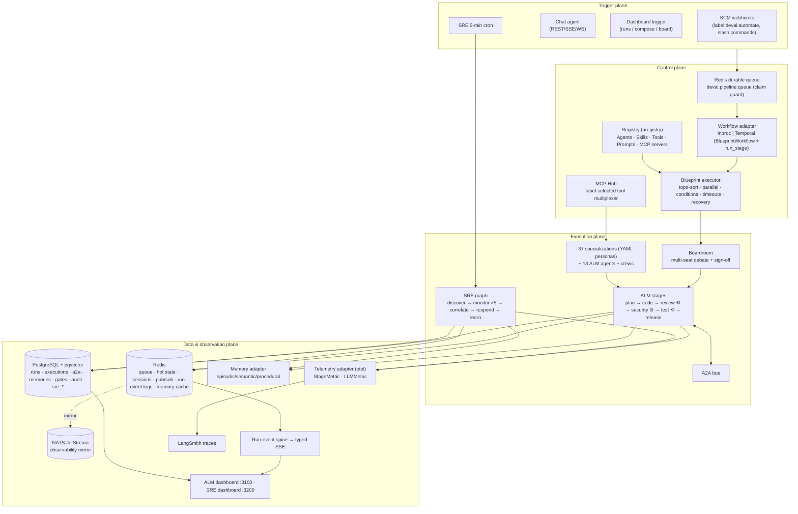
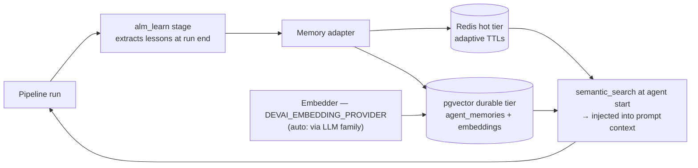
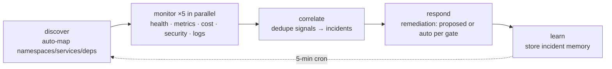

# DevAI Platform Architecture — End-to-End Reference

**Status:** Living document — snapshot 2026-06-12
**Audience:** anyone who needs to understand, operate, extend, or **rebuild** this platform.
**Companions:** `docs/plans/vertex-multi-model/IMPLEMENTATION-PLAN.md` (LLM plane),
`docs/deploy/CONTROL-PLANES.md` (prod deploy runbook), `docs/IMPROVEMENT_PLAN.md`
(authoritative gap backlog), `docs/agentic/MCP-HUB.md`, `docs/agentic/IMPLEMENTATION-PLAN-SDK-ADK.md`.

---

## Table of Contents

1. [What DevAI Is](#1-what-devai-is)
2. [System Design — the Big Picture](#2-system-design--the-big-picture)
3. [Deployables, Processes & Ports](#3-deployables-processes--ports)
4. [Prerequisites & Requirements](#4-prerequisites--requirements)
5. [The Agent Fleet](#5-the-agent-fleet)
6. [Orchestration — Blueprints, Executor, Workflow Backbone](#6-orchestration)
7. [The Boardroom](#7-the-boardroom)
8. [A2A — Agent-to-Agent Communication](#8-a2a--agent-to-agent-communication)
9. [Adapter Families — Every External Integration](#9-adapter-families)
10. [External Services & Data Stores](#10-external-services--data-stores)
11. [Memory — How the Platform Learns and Retains](#11-memory)
12. [Self-Healing & Resilience](#12-self-healing--resilience)
13. [Analytics & Observability](#13-analytics--observability)
14. [Dashboards & Auth](#14-dashboards--auth)
15. [Registry, MCP Hub & Skills](#15-registry-mcp-hub--skills)
16. [SCM, Webhooks & Triggers](#16-scm-webhooks--triggers)
17. [CI/CD & Deployment Topology](#17-cicd--deployment-topology)
18. [End-to-End Run Walkthrough](#18-end-to-end-run-walkthrough)
19. [Gaps, Caveats & Tech Debt (honest list)](#19-gaps-caveats--tech-debt)
20. [Rebuild Checklist — Doing It Again, Prod-Ready](#20-rebuild-checklist)

---

## 1. What DevAI Is

DevAI is an **AI-native Application Lifecycle Management (ALM) + SRE platform**. Given a
requirement (a labeled issue, a document, a chat instruction), a fleet of LLM-backed agents
plans, implements, reviews, security-scans, tests, and ships code to a target repository —
then a second fleet autonomously monitors the resulting workloads on Kubernetes, correlates
incidents, and proposes/applies remediations. Everything is observable in real time from two
Next.js dashboards.

**Capability summary (what works today):**

- Full ALM pipeline: requirement → epic/stories → plan → code → DB engineering → review loop
  → security gate → CI monitoring → tests → infra → release, run as a declarative **blueprint**.
- **Boardroom**: a multi-seat agent debate that produces and signs off a plan before execution,
  with mandatory sign-off, a "debate more" loop, and a 15-minute budget.
- **A2A bus**: typed agent-to-agent messages (request/response/notification/handoff/escalation/
  broadcast) persisted to Redis + Postgres and rendered live in the dashboard.
- **Memory**: episodic/semantic/procedural memory per agent, retained across runs (Redis hot,
  pgvector durable), injected into prompts; an `alm_learn` stage closes the learning loop.
- **Self-healing**: bounded review/test loops, hard security gate with re-implement, transient
  retry + autonomous healing rounds in the blueprint executor, checkpoint resume, circuit
  breakers, LLM fallback chains, and graceful adapter degradation (everything Noop-able).
- **SRE loop**: 7 agents on a 5-minute autonomous cycle (discover → monitor ×5 parallel →
  correlate → respond → learn) over the cluster, with incident lifecycle + remediation records.
- **Governance**: approval gates (human-in-the-loop), autonomy gates, audit log, per-tenant
  registry visibility.
- **Extensibility**: 12 adapter families (LLM, memory, workflow/Temporal, event bus, secrets,
  telemetry, object store, registry, identity, messaging, web search, observability); 37
  specialization personas in YAML; 14 blueprints; 369 imported community skills; an MCP Hub
  multiplexing 53+ tools; a dashboard authoring editor that publishes artifacts to the registry.
- **Pipeline hardening** (recent): **output contracts** on every quality-gate agent (no empty
  0.0-second "successes"), `devai:run` correlation labels on every artifact, **continuous
  orphan reconciliation** (pending runs self-heal in 60s), true STOP semantics (interrupts the
  in-flight stage; stopped runs can never resurrect), epic supervision (tracked stories,
  milestone comments, status labels), clarity-gated plan approval (proposes concrete choices
  instead of sailing through), QA that executes through the **target repo's own CI** when no
  local toolchain exists, and fence-tolerant LLM JSON parsing.
- **Conversational channels**: one chat brain (19 tools) behind a transport-agnostic
  **ConversationGateway** (`src/devai/chat/gateway.py`) — dashboard REST/SSE/WS today, with
  Slack / remote-URL threads / MCP-client channels per `docs/REMOTE_CHANNELS_PLAN.md`.
- **Per-user/tenant settings**: `src/devai/settings/` — connector credentials scoped
  user → team → tenant → global, secret **values** in GCP Secret Manager, DB stores refs only;
  a `PrincipalSettingsOverlay` routes a user's own creds through the existing adapter factories.
- **Target-repo governance**: agents create and maintain the target repository's own
  conventions file so stack skills and conventions travel with the repo across runs.
- **Live preview** (early): a preview stage + dashboard spike today; the full Lovable-style
  in-cluster hot-reload preview (PES spec → resolver → engine → verify/self-heal loop, backend
  + mock data + auto-wiring included) is specified in `docs/LIVE_PREVIEW_PLAN.md`.

---

## 2. System Design — the Big Picture

The platform is best understood as four planes:



External systems: **SCM** (GitHub / GitLab / Azure DevOps) for repos, PRs, issues, CI status;
**Kubernetes** (read + remediation via kubectl tools) for SRE; **LLM providers** (Anthropic
primary today; Vertex AI plan in `docs/plans/vertex-multi-model/`); **Keycloak** for auth;
**GCP Secret Manager** for secrets; **otel-collector** for telemetry export.

---

## 3. Deployables, Processes & Ports

| Process | Entry point | Port | Purpose |
|---|---|---|---|
| **devai-api** | `devai.webhook.app` (FastAPI) | 8080 | Webhooks, chat, dashboard API, run-event SSE, registry proxy, pipeline enqueue |
| **devai-sre** | `devai-sre` → `devai.sre.server:create_sre_app` | 8090 | SRE FastAPI app + 5-min autonomous scan loop |
| **devai-worker** | `devai-worker` → `devai.orchestration.worker:main` | — | Queue consumer / Temporal worker — claims runs from `devai:pipeline:queue`, drives the blueprint executor |
| **devai-mcp-hub** | `devai-mcp-hub` → `devai.mcphub:create_hub_app` | (cfg) | Protocol-complete MCP multiplexer over registry Tools |
| **dashboard** | `dashboard/` Next.js (standalone) | 3100 | ALM dashboard |
| **sre-dashboard** | `sre-dashboard/` Next.js (standalone) | 3200 | SRE dashboard |
| **auth-bff** | `services/auth-bff` (shared image) | 8090 | OIDC Backend-for-Frontend, session cookies |
| **devai** CLI | `devai.cli.commands:app` | — | Operator CLI (trigger runs, manage config) |

Supporting infra pods (deployed from `tesserix-k8s`): PostgreSQL 16 + pgvector, Redis, NATS
(optional), otel-collector, Keycloak (shared), the three Solo.io control planes (aregistry,
agentgateway, kagent), and optionally a Temporal server.

> **Caveat:** api and sre **share** `devai:pipeline:queue`; the claim guard (run-claim key) is
> what prevents double execution. Any new consumer must respect it.

---

## 4. Prerequisites & Requirements

### 4.1 Required backing services

| Service | Needed for | Notes |
|---|---|---|
| PostgreSQL 16 + `pgvector` + `uuid-ossp` | runs, executions, a2a, memories, gates, audit, all `sre_*` | Schema bootstrap: gated initContainer on devai-api (local); `db-schema-bootstrap` CronJob in `tesserix-k8s` (prod). Reference DDL in `db/migrations/` (do **not** add files there). |
| Redis | queue, hot state, sessions, pub/sub, run-event logs, memory cache | The platform is **not functional** without Redis. |
| Keycloak (or `local_db` auth) | dashboard/API auth | Realms `devai` and `devai-sre`; local sandbox uses `DEVAI_AUTH_PROVIDER=local_db` (admin/dev/qa/designer). |
| NATS JetStream | optional — observability mirror only | No longer the job queue. Safe to omit (`DEVAI_EVENT_BUS_PROVIDER=noop`). |
| Temporal | optional — durable workflow execution | Only when `DEVAI_WORKFLOW_PROVIDER=temporal`; default `inproc` needs nothing. |
| otel-collector | optional — telemetry export | `DEVAI_TELEMETRY_PROVIDER=otel`. |
| aregistry (+ agentgateway, kagent) | registry-backed agents/skills/tools | `DEVAI_REGISTRY_PROVIDER=tesserix`; seeded by ~83 registry-seed CRs. |

### 4.2 Provider selectors (the platform's "wiring diagram" in env vars)

All config is Pydantic Settings, prefix `DEVAI_`, in `src/devai/config.py`:

| Setting (config.py line) | Default | Options |
|---|---|---|
| `event_bus_provider` (74) | `nats` | noop, nats |
| `scm_provider` (125) | `github` | github, gitlab, azure_devops |
| `auth_provider` (178) | `keycloak` | keycloak/GIP, local_db |
| `workflow_provider` (354) | `inproc` | inproc, temporal, noop |
| `observability_provider` (427) | `""` | informational; fan-out multi-provider |
| `telemetry_provider` (462) | `noop` | noop, otel |
| `web_search_provider` (496) | `noop` | noop, … |
| `object_store_provider` (502) | `noop` | noop, s3/gcs/local (per family) |
| `registry_provider` (531) | `tesserix` | tesserix (aregistry), noop |
| `llm_provider` (589) | `anthropic` | noop, anthropic, openai (Vertex planned) |
| `secrets_provider` (605) | `noop` | noop, env, gcp_sm |
| `memory_provider` (615) | `redis` | noop, redis, pgvector, mem0, zep, hondo |
| `embedding_provider` (621) | `auto` | auto, openai, none |

### 4.3 Credentials & external prereqs

- **LLM keys:** `DEVAI_ANTHROPIC_API_KEY` (primary), `DEVAI_OPENAI_API_KEY`, `DEVAI_GROQ_API_KEY`,
  `DEVAI_GEMINI_API_KEY` — several resolvable via GCP SM (`DEVAI_GCP_SECRET_*`).
- **SCM:** GitHub App or fine-grained PAT. Repo onboarding/creation needs a PAT with
  **Administration + Contents + Workflows** write (prod secret `prod-devai-github-pat`).
  Webhook secret `DEVAI_GITHUB_WEBHOOK_SECRET` — **must be set**; verification fails open
  when empty (see §19).
- **GCP:** project `tesseracthub-480811`, Workload Identity SA for Secret Manager (and Vertex,
  once adopted), WIF for keyless CI auth.
- **LangSmith:** `DEVAI_LANGCHAIN_API_KEY` + `DEVAI_LANGCHAIN_TRACING_V2` for traces.
- **Local sandbox:** `connect-local` first (kind cluster, `argo.sandbox.app` / `localhost:5050`),
  deploy via `sandboxctl`; local-only artifacts are `sandboxctl.yaml`, `values-local.yaml`,
  `k8s/secrets.yaml`.

---

## 5. The Agent Fleet

Three layers, from concrete to declarative:

### 5.1 ALM Python agents (13, `src/devai/agents/`)

| Agent | Pipeline role | LLM today (hardcoded) |
|---|---|---|
| DocumentAnalyzer | ingest docs/issues into structured requirements | Gemini (Groq fallback) |
| TechDetector | detect stack/conventions of target repo | Groq |
| RequirementsAnalyst | refine requirements | OpenAI |
| ProductDirector | epic/story creation, prioritization | OpenAI (o3) |
| EngineeringManager | plan, task breakdown, coordination | Claude |
| SeniorDeveloper | implementation, branches, PRs | Claude |
| DBEngineer | schema/migration work | Claude |
| StaffReviewer | code review loop | OpenAI (Codex sandbox) |
| SecurityExpert | security scan gate | Claude |
| QATester | test authoring/execution | Claude |
| CIMonitor | watch CI, parse failures | Groq |
| InfraProvisioner | infra/helm provisioning | Claude |
| ReleaseManager | release/deploy | Groq |

> The per-agent provider table is implemented as **hardcoded imports of legacy
> `src/devai/providers/` wrappers**, not via the adapter factory — see §19 and the Vertex plan
> (which replaces this with per-spec routing).

### 5.2 Specializations (37 YAML personas, `specializations/`)

Categories: planning, coding, review, orchestration, specialists, sre. Each YAML declares:
identity/persona prompt, `llm_provider` / `llm_model` / `temperature` / `max_tokens`,
`allowed_tools`, skill references, and optionally `legacy_python_class` — the **bridge**
pattern: ~22 specs bridge to the Python agents above; the rest are YAML-only and run through
the generic specialization stage (`src/devai/pipeline/stages/specialization.py`).

### 5.3 SRE agents (7, `src/devai/sre/agents/`)

Discovery, Health, Metrics, Cost, Security, Correlator, IncidentResponder — orchestrated by
the 5-node SRE graph (§12.3).

### 5.4 Crews (`crews/*.yaml`)

`backend_crew`, `frontend_crew`, `sre_crew` — named groups of specializations executed by the
`crew_runner` stage for parallel team-style work (the "collaborative parallel team, not
sequential waterfall" model).

### 5.5 Skills

Registry-seed Skill YAMLs (`architecture/registry-seeds/skills/`), including **369 imported
community skills** (VoltAgent + awesome-ai-sre) under `skills/community/` with the generator at
`_import/`. Skills attach to agents at runtime via per-stack **skill profiles**; the target
repo's `CLAUDE.md` is maintained by the agents to carry the stack's skills and conventions.

---

## 6. Orchestration

### 6.1 Blueprints (declarative pipelines)

A blueprint (`blueprints/*.yaml`) declares stages with dependencies, conditions, per-stage
timeouts, and recovery policy. The executor (`src/devai/blueprint/executor.py`) topologically
sorts stages, runs independent stages in parallel, evaluates `conditions`
(`src/devai/blueprint/conditions.py`), enforces timeouts, and applies recovery (transient
retries, autonomous-healing rounds — max 3, bug-filing, runbook generation on failure).

**Shipped blueprints (14):**

| Blueprint | Purpose |
|---|---|
| `alm-pipeline.yaml` | full ALM flow (the 27-stage successor of the legacy 14-node graph) |
| `boardroom-plan.yaml` | boardroom debate → signed-off plan |
| `supervisor-alm.yaml` | supervisor-driven ALM variant |
| `app-scaffold.yaml` | new-app scaffolding (pairs with "New repo" onboarding) |
| `crew-task.yaml` | run a crew on a task |
| `pr-review.yaml` | standalone PR review |
| `security-scan.yaml` | standalone security scan |
| `sre-monitor.yaml` | the 5-min SRE cycle |
| `sre-incident-response.yaml` | incident response flow |
| `sre-deployment-health.yaml` | deploy health verification |
| `sre-cost-optimization.yaml` | cost review |
| `sre-reliability-review.yaml` | reliability audit |
| `sre-security-audit.yaml` | cluster security audit |
| `sre-supervised-ops.yaml` | human-supervised ops actions |

Stage implementations live in `src/devai/pipeline/stages/` (30+ registered): `alm.py`
(adapters around the 13 agents), `boardroom.py`, `specialization.py`, `crew_runner.py`,
`job_runner.py` (agents as K8s Jobs — the SDK/ADK direction), `governance.py` (gates,
approvals), `lifecycle.py` (run bookkeeping), `preview.py` (live preview), `sre.py`.

Stages receive **`StageDeps`** — the dependency-injection bundle built in
`src/devai/pipeline/bootstrap.py`: typed optional adapter handles (`deps.llm`, `deps.memory`,
`deps.telemetry`, `deps.scm`, …). Every stage must tolerate `None`/Noop.

### 6.2 Workflow backbone (durability)

`src/devai/adapters/workflow/` — `DEVAI_WORKFLOW_PROVIDER`:

- **`inproc`** (default): executor runs inside the worker process. Simple; **no durability** —
  a pod restart loses in-flight runs (checkpoint resume mitigates, §12).
- **`temporal`**: ONE generic `BlueprintWorkflow` + a `run_stage` activity. Any blueprint/agent
  becomes durable with no per-pipeline code: replayable history, stage-level retries, worker
  crash recovery. Requires a Temporal server + the `devai-worker` registered on the task queue.
- **`noop`**: tests.

### 6.3 Queue & claiming

Triggers enqueue runs onto **`devai:pipeline:queue`** (Redis, durable). Consumers (api worker,
sre) must take the **claim guard** before executing — this is what makes multiple consumer
processes safe. Run state checkpoints at stage boundaries.

### 6.4 Legacy path (still present)

`src/devai/graph/orchestrator.py` is the original LangGraph 14-node (now ~23-node) monolith;
`src/devai/core/pipeline.py` is an even earlier orchestrator. **Three orchestrators coexist** —
the blueprint executor is the strategic one; the others are kept for the legacy bridge but are
the source of several known bugs (§19).

---

## 7. The Boardroom

`src/devai/pipeline/stages/boardroom.py` + dashboard `board/` page (`boardroom-card.tsx`,
`boardroom-graph.tsx`).

- **Seats:** a core panel (e.g. product, engineering, security) plus **dynamically recruited
  specialists** based on the topic; each seat is a specialization persona with its own LLM call.
- **Debate:** seats exchange positions over the A2A bus in rounds; a synthesizer drafts the
  decision; a **"debate more" loop** re-opens contested points.
- **Sign-off:** **mandatory** — every seat must approve or the plan does not pass; the result
  is written as an approval-gate record and the signed plan becomes the input to execution.
- **Budget:** hard **15-minute** wall-clock budget on the whole boardroom stage.
- **Autonomy gates** (`tests/unit/test_autonomy_gates.py`): static + dynamic gates decide
  whether a run may proceed unattended or must wait for human approval; gates show as
  pending **only when actually reached** by the run.

---

## 8. A2A — Agent-to-Agent Communication

`src/devai/graph/a2a.py` — the `A2ABus`.

- **Message types:** `request`/`response` (structured ask/answer), `notification`,
  `handoff` (ownership transfer), `escalation` (blocker to upstream), `broadcast`.
- **Transport:** JSON-RPC-style envelopes; agent cards with verification; SSRF guards on
  remote agent URLs.
- **Persistence:** messages flow through run state (`a2a_messages`), persist to **Redis**
  (hot, feeds SSE) and **PostgreSQL `a2a_messages`** (durable, feeds dashboard timeline).
- **Consumption:** the run-event hub derives the A2A feed; dashboard renders a live timeline
  per run, plus the boardroom graph view of seat-to-seat exchanges.

> Caveat: the broadcast roster knows ~10 roles while the graph drives ~20 (§19) — broadcasts
> don't reach every agent.

---

## 9. Adapter Families

**The** load-bearing pattern of the codebase (see CLAUDE.md §6): every external integration is
`src/devai/adapters/<family>/` with `base.py` (ABC + canonical record), `factory.py`
(`DEVAI_<FAMILY>_PROVIDER`, **never raises** — degrades to Noop), `noop.py` (mandatory),
one file per backend with **lazy SDK imports**, wired through `StageDeps`, proven by shared
contract tests.

| Family | Providers (today) | Selector / default | Consumed by |
|---|---|---|---|
| `llm` | anthropic, openai, noop (+ instrumented wrapper) | `llm_provider=anthropic` | all agents/stages via `deps.llm`; probe endpoint |
| `memory` | redis, pgvector, mem0, zep, hondo, noop | `memory_provider=redis` | memory injection, alm_learn, chat |
| `workflow` | inproc, temporal, noop | `workflow_provider=inproc` | run execution backbone |
| `event_bus` | nats, noop | `event_bus_provider=nats` | observability mirror |
| `secrets` | gcp_sm, env, noop | `secrets_provider=noop` | key resolution at boot |
| `telemetry` | otel, noop | `telemetry_provider=noop` | StageMetric/LLMMetric sink |
| `object_store` | (family scaffolded) noop default | `object_store_provider=noop` | artifacts/preview |
| `registry` | tesserix (aregistry), noop | `registry_provider=tesserix` | agents/skills/tools/prompts resolution |
| `identity` | keycloak/GIP, local_db | `auth_provider=keycloak` | dashboard/API auth |
| `messaging` | (channels: e.g. slack/webhook) noop | per-channel | notifications |
| `web_search` | noop default | `web_search_provider=noop` | research-capable agents |
| `observability` | fan-out (multi-provider) | `observability_provider=""` | log/trace export |
| `scm` (pre-dates family layout, `src/devai/scm/`) | github, gitlab, azure_devops | `scm_provider=github` | all repo operations |

**Rules that make this work (apply to every new family):** one ABC per family; lazy SDK
imports; factory never raises; Noop always ships; settings under one `# --- family ---` block;
shared contract test suite per backend; never import a vendor SDK in business logic.

---

## 10. External Services & Data Stores

### 10.1 PostgreSQL (+ pgvector, uuid-ossp)

Tables (reference DDL `db/migrations/0001`/`0002`):

- **ALM:** `pipeline_runs`, `agent_executions`, `a2a_messages`, `agent_memories`,
  `approval_gates`, `audit_log`, `db_migration_audit`, `security_findings`, `pipeline_config`
- **SRE:** `sre_clusters`, `sre_apps`, `sre_incidents`, `sre_health_checks`, `sre_metrics`,
  `sre_cost_reports`, `sre_remediations`, `sre_scan_runs`

Access via `src/devai/services/database.py` (SQLAlchemy/asyncpg). Schema lifecycle is owned by
`tesserix-k8s` (`db-schema-bootstrap`); local dev applies the mirrored SQL via a gated
initContainer.

### 10.2 Redis (the platform's nervous system)

| Use | Pattern |
|---|---|
| Durable run queue | `devai:pipeline:queue` + **claim guard** key per run |
| Hot run state / locks | run-scoped keys, checkpointed at stage boundaries |
| Sessions | chat + dashboard session keys |
| Pub/sub | run-event fan-out to SSE |
| **Durable run-event logs** | per-run append logs (events/agent turns) — survive dashboard reconnects |
| Memory cache | hot tier of the memory adapter (adaptive TTLs) |
| A2A hot copy | recent messages for live feeds |

> **Fiber-style runs persist to Redis, not Postgres** — analytics reads must account for this.

### 10.3 NATS JetStream

**Legacy job-bus role is retired.** NATS is now only an optional observability mirror
(`event_bus_provider=nats`); ack/nak/term handling was fixed (IMPROVEMENT_PLAN 0.6). Omit it
freely in new deployments.

### 10.4 Temporal

Optional durability backbone (§6.2). Run a Temporal server + `devai-worker`; flip
`DEVAI_WORKFLOW_PROVIDER=temporal`. No per-blueprint code needed — this is the recommended
prod setting once operationalized.

### 10.5 LLM providers

Anthropic (primary), OpenAI (ProductDirector/StaffReviewer), Groq + Gemini (legacy wrappers),
NemoClaw self-hosted vLLM/NIM (`nemotron-3-super-120b-a12b`, Groq fallback). Target state —
**Vertex AI as the regulated in-VPC plane with direct Anthropic fallback** — is specified in
`docs/plans/vertex-multi-model/IMPLEMENTATION-PLAN.md`.

**Private Vertex access is live (2026-06-12):** a PSC endpoint (`vertex-psc-ip` = 10.255.0.2,
forwarding rule `vertexapis`, all-apis bundle) + a private DNS zone pinning
`aiplatform.googleapis.com` to it, inside `tesseract-prod-in-vpc` — managed by Terraform stack
`tesserix-k8s/terraform-new/stacks/12-vertex` (state imported, plan clean). IAM:
`roles/aiplatform.user` on `app-secrets-devai-prod@` (DevAI pods) and `agentgateway-llm@`
(gateway GSA, Workload-Identity-bound to `agentgateway-system/agentgateway`).

**LLM egress direction — agentgateway:** DevAI's factory now registers a `gateway` provider
(`DEVAI_LLM_GATEWAY_BASE_URL` → the solo.io agentgateway's OpenAI-compatible `ai-gateway`
service). The gateway maps model aliases to any backend (Vertex Gemini/Claude, Anthropic,
OpenAI) and owns the credentials, keeping DevAI provider-independent. Caveat: the gateway
chart wrapper currently runs at replicaCount 0 pending adoption of the upstream Helm chart —
direct provider adapters remain the active path until then.

---

## 11. Memory

### 11.1 Model

Canonical surface (`src/devai/adapters/memory/base.py`): `remember / recall / semantic_search
/ forget` over a canonical record. Three memory **types**:

- **Episodic** — what happened in past runs (run summaries, failures, fixes)
- **Semantic** — learned patterns, repo conventions
- **Procedural** — how-to knowledge for recurring tasks

### 11.2 Retention pipeline



- **Write:** `alm_learn` runs at the end of a pipeline and stores distilled lessons; agents
  can also `remember()` mid-run; SRE `learn` node does the same for incidents.
- **Read:** before each agent execution the runner performs `semantic_search` scoped to
  agent + repo and injects hits into the prompt (cross-run learning).
- **Tiers:** Redis = hot cache with **adaptive TTLs** per memory type; pgvector = durable +
  semantically searchable. `memory_provider` swaps the whole backend (mem0/zep/hondo
  available); Noop = amnesia mode, everything still runs.

### 11.3 Caveats

Embedding provider `auto` resolves through the LLM family — with Anthropic-only keys there is
no native embedder, so semantic search silently degrades unless OpenAI (or, post-Vertex,
`text-embedding-005`) is configured. No global eviction policy beyond TTLs — pgvector grows
unbounded (add retention jobs in a rebuild).

---

## 12. Self-Healing & Resilience

### 12.1 Pipeline-level loops & gates

| Mechanism | Behavior | Where |
|---|---|---|
| Review loop | review ⟲ re-implement, **max 3** iterations (`DEVAI_MAX_REVIEW_ITERATIONS`) | orchestrator/blueprint conditions |
| Security gate | **hard gate** — block → re-implement; findings → `security_findings` | security stage |
| Test loop | run_tests ⟲ fix, **max 2** | test stage |
| Stage timeout | 15 min per node/stage | executor + legacy graph |
| Checkpoint resume | `StateCheckpoint` saves at stage boundaries; resume-from-failure | `services/resilience.py` |
| Transient retry + healing | executor retries transient failures, then up to **3 autonomous healing rounds**; on final failure files a bug and generates a runbook | blueprint executor recovery |
| Approval gates | human-in-the-loop pause (dashboard approval banner); autonomy gates decide unattended vs gated; plan approval is **clarity-gated** and proposes concrete choices | governance stage + `approval_gates` |
| Output contracts | every quality-gate agent must satisfy an output contract — empty/instant "successes" are rejected as failures | pipeline service |
| Orphan reconciliation | continuous reconciler re-claims pending/stuck runs within ~60s (pod crash, lost claim) | pipeline service |
| STOP semantics | stop interrupts the **in-flight stage** (not just level boundaries); terminal states are final — stopped runs cannot resurrect | pipeline + dashboard DAG overlay |
| Self-healing test loop | diagnose → file a linked bug → fix → re-test; QA can execute via the **target repo's own CI** when no local toolchain | QA/test stages |
| Epic supervision | stories tracked against the epic with milestone comments + status labels — drift is visible and recoverable | supervision flow |

### 12.2 Service-level resilience (`src/devai/services/resilience.py`)

`retry_async` (exponential backoff, separate rate-limit budget), `with_timeout`,
`CircuitBreaker` (state-tracked, wraps provider calls), `StateCheckpoint`. LLM fallback
chains: NemoClaw → Groq; planned Vertex → Anthropic-direct. Every adapter family degrades to
Noop instead of crashing the pod.

### 12.3 SRE autonomous loop (the ops self-healing arm)



7 agents over kubectl wrapper tools (read-heavy; mutations gated). Full incident lifecycle in
`sre_incidents` / `sre_remediations`, GitHub integration for filing issues, scan history in
`sre_scan_runs`. **Remediations are recorded and gated** — supervised ops via
`sre-supervised-ops.yaml`; fully-auto apply is intentionally conservative.

---

## 13. Analytics & Observability

Three complementary spines:

1. **Run-event spine (realtime):** stages and agent turns emit typed `StageEvent`/`AgentTurn`
   into an in-proc hub → ring buffer → **typed SSE endpoints** consumed by the dashboard, with
   **durable Redis per-run logs** so reconnects/refreshes replay history. Agents, A2A feed,
   and run progress in the UI are all derived in the hub from this one stream.
2. **Telemetry adapter (metrics):** `DEVAI_TELEMETRY_PROVIDER=otel|noop`. Every LLM call is
   wrapped by `InstrumentedLLMAdapter` → `LLMMetric` (agent, provider, model, tokens in/out,
   latency, status); stages emit `StageMetric`. Exported via the **otel-collector** chart.
   (Prometheus/Grafana currently disabled in `tesserix-k8s`; collector is the egress point.)
3. **LangSmith (traces):** `@traceable` decorators across agents/graphs;
   `DEVAI_LANGCHAIN_TRACING_V2` + API key + project.

**Analytics UI:** `dashboard/src/app/analytics/` — aggregates token/cost/latency per agent and
per run, stage durations, fallback rates. **Data caveat:** Fiber-style runs persist to Redis
(not Postgres), so analytics reads both stores; a rebuild should unify run persistence.

**Audit:** `audit_log` table + registry publish audit; SRE scan history.

---

## 14. Dashboards & Auth

### 14.1 ALM dashboard (Next.js, :3100) — pages (`dashboard/src/app/`)

| Page | Purpose |
|---|---|
| `/` + `runs/[id]` | run list, live run view (stages, agents, A2A, gates, logs via SSE) |
| `board` | boardroom view — seats, debate timeline, `boardroom-graph.tsx`, sign-off state |
| `agents`, `skills`, `tools`, `prompts`, `registry` | registry browsing + **authoring editor** (form + live YAML/JSON + lint + publish via `POST /api/registry/{plural}`) |
| `blueprint`, `workflows` | blueprint rendering/runs |
| `compose` | compose/trigger new work |
| `repos` | repo onboarding incl. **"New repo"** create→scaffold→auto-onboard |
| `analytics` | §13 |
| `logs` | durable run logs |
| `gateway` | agentgateway view |
| `sre-studio` | SRE authoring/ops studio |
| `settings`, `login` | config + auth |

API access via `dashboard/src/lib/api.ts` + Next API proxy routes; dashboards are deployed as
**their own charts** (sandboxctl routes one URL per chart) and proxy to internal api/sre via
`DEVAI_API_INTERNAL_URL`.

### 14.2 SRE dashboard (:3200)

Cluster overview, incident feed, scan history (+ healthz, login).

### 14.3 Auth

Identity adapter: **Keycloak/GIP** in prod (Google SSO, allow-listed users
`samyak.rout@gmail.com`, `mahesh.sangawar@gmail.com`; realms `devai`, `devai-sre`; shared
**auth-bff** issuing `devai_session` HttpOnly cookie; Next middleware enforces) — or
**`local_db`** for the sandbox (admin/dev/qa/designer). A `Principal` model propagates
identity into runs/audit. **Known gap:** approval/reject API routes don't enforce authz when
auth is disabled (§19).

---

## 15. Registry, MCP Hub & Skills

- **Registry (aregistry):** the source of truth for **Agents, Skills, Tools, Prompts,
  MCP-servers** as CRD-style artifacts. ~83 seed CRs in `architecture/registry-seeds/`.
  Tenancy: visibility defaults **PRIVATE** (seeds set public); tenant = namespace =
  uniqueness boundary; publish enforces per-tenant name uniqueness (409 + overwrite);
  optional `devai.io/team` label.
- **MCP Hub** (`devai-mcp-hub`, design `docs/agentic/MCP-HUB.md`): registry-driven,
  protocol-complete MCP **multiplexer** — agents see one MCP endpoint; the hub resolves tools
  by **label selectors** with pull-through resolution (registry → internet → cache → notify).
  Phase 1 (53 first-class Tools) shipped.
- **Skills:** profile-per-stack; agents maintain the target repo's `CLAUDE.md` so conventions
  and skills travel with the repo; 369 community skills imported as registry seeds.
- **SDK/ADK direction:** one Agent contract + one dispatcher; agents as **K8s Jobs**
  (`job_runner` stage); north star is zero-code custom agents authored via UI/YAML
  (`docs/agentic/IMPLEMENTATION-PLAN-SDK-ADK.md`).

### 15.1 Per-user / per-tenant settings & connectors (`src/devai/settings/`)

Implemented (`service.py`, `overlay.py`; design `docs/SETTINGS_CAPABILITY.md`): all connectors
(LLM, SCM, memory, Slack, MCP, web-search) configurable from the Settings page, scoped
**user → team → tenant → global** (most-specific wins). **Secret split:** values go to the
secrets adapter (GCP Secret Manager); Postgres stores only `SecretRef` names. At request/run
time `build_overlay(principal)` produces a `PrincipalSettingsOverlay` wrapping global
`Settings` — and because every adapter factory reads config via `getattr(settings, …)`, a
user's own credentials drive their conversations **and** their pipeline runs with zero
factory changes. This is also the multi-tenancy seam for a SaaS-shaped rebuild.

### 15.2 Live preview (early)

Today: a `preview` pipeline stage (`src/devai/pipeline/stages/preview.py`) + dashboard spike
(`docs/preview-spike.yaml`). The full design (`docs/LIVE_PREVIEW_PLAN.md`) is a
Lovable/Bolt-style **in-cluster, hot-reloading full-stack preview**: any repo is normalized
into a **Preview Environment Spec (PES)** by a three-tier resolver (explicit → detected →
AI-synthesized), one engine materializes any PES into running, auth-gated, seeded K8s
(frontend + backend + datastores + mock data + auto-wired API↔UI), and a verify-and-self-heal
loop brings it up, detects reality, auto-fixes, and retries. One mechanism for every repo
shape — no per-repo special-casing.

### 15.3 Target-repo governance

Agents create and **maintain the target repository's own conventions file** — the stack's
skills, conventions, and decisions persist in the repo itself, so every later run (and any
human contributor) inherits them. Combined with skill profiles per stack, this is how repo
knowledge compounds across runs.

---

## 16. SCM, Webhooks & Triggers

- **SCM layer** (`src/devai/scm/`): abstract `SCMClient`; GitHub (App/PAT/OAuth), GitLab
  (PAT/OAuth, MR translation), Azure DevOps (PAT, Work Items); `create_scm_client(config)`.
- **Webhook app** (`src/devai/webhook/`): receives GitHub/GitLab/ADO events; a run triggers
  when an issue/PR carries `DEVAI_PIPELINE_LABEL` (default `devai:automate`) or via slash
  commands; signature verification per provider (**fails open if secret unset** — §19);
  principal extracted and stamped on the run; run enqueued to the Redis queue.
- **Other triggers:** chat agent (LangChain ReAct, **19 tools** — data queries + SCM repo
  tools, REST/SSE/WS at `/chat/*`), dashboard compose/board/runs, SRE cron, `devai` CLI.
- **Conversational channels:** the chat brain sits behind a transport-agnostic
  **ConversationGateway** (`src/devai/chat/gateway.py`, wired in `webhook/app.py`):
  `ConversationTurn`/`ConversationReply` DTOs, `conversation_id` as the universal thread key
  (`slack:{channel}:{thread_ts}`, remote URL threads, MCP sessions), Principal attribution +
  audit on every turn, with A2A injection and pipeline triggering available from any channel.
  Slack / remote-URL / MCP transports per `docs/REMOTE_CHANNELS_PLAN.md` +
  `REMOTE_CHANNELS_SETUP.md` — one brain, never duplicated per channel.

---

## 17. CI/CD & Deployment Topology

### 17.1 CI (`.github/workflows/`, 8 workflows)

| Workflow | Builds |
|---|---|
| `ci.yaml` | lint → test → `ghcr.io/tesserix/devai` → Trivy SARIF |
| `sre-build.yaml` | `ghcr.io/tesserix/devai-sre` |
| `dashboard-build.yaml` | `ghcr.io/tesserix/devai-dashboard` |
| `sre-dashboard-build.yaml` | `ghcr.io/tesserix/devai-sre-dashboard` |
| `release.yaml` | tag `v*` → all 4 images + GitHub Release |

WIF keyless GCP auth; lint is `continue-on-error` (non-blocking — caveat). Org has limited
private-repo Actions minutes → public→build→private cycle (repo currently public, locked
down; see CLAUDE.md).

### 17.2 Prod (GKE via ArgoCD — never `kubectl apply`)

Per `docs/deploy/CONTROL-PLANES.md`: **9 ArgoCD apps** — 3 Solo.io control planes at negative
sync waves (aregistry `-5`, agentgateway `-4`, kagent `-3` in their `*-system` namespaces) +
DevAI workload (api, sre, dashboard, sre-dashboard, postgres, auth-bff) + registry bootstrap
(~83 seed CRs). Shared `aregistry-jwt` secret via GCP SM + ExternalSecret + Reflector. All
charts/values live in `tesserix-k8s`; ArgoCD app defs under `argocd/prod/`. Istio: new public
hostnames need VirtualService + `istio-auth-policies.yaml` allowlist + possibly a gateway
restart.

### 17.3 Local sandbox

`connect-local` → kind cluster; `sandboxctl` drives a local Argo (`localhost:5050`); one URL
per chart; local-only values files; `local_db` auth; schema via gated initContainer.

> Ops gotcha: updating the GitHub PAT secret requires **deleting pods**, not
> `rollout restart` (ArgoCD reverts the restart annotation).

---

## 18. End-to-End Run Walkthrough

```mermaid
sequenceDiagram
    participant GH as GitHub
    participant WH as devai-api (webhook)
    participant Q as Redis queue
    participant W as devai-worker
    participant EX as Blueprint executor
    participant BR as Boardroom
    participant AG as Agents (specializations)
    participant SCM as SCM client
    participant UI as Dashboard (SSE)
    GH->>WH: issue labeled devai:automate
    WH->>WH: verify signature, extract principal
    WH->>Q: enqueue run (durable)
    W->>Q: claim (claim guard)
    W->>EX: execute blueprint (inproc | Temporal)
    EX->>BR: boardroom-plan — seats debate, sign-off (≤15m)
    BR-->>EX: signed plan (approval gate recorded)
    loop stages (topo order, parallel where independent)
        EX->>AG: run stage (StageDeps: llm, memory, scm, telemetry)
        AG->>AG: inject memories (semantic_search)
        AG->>SCM: branches, commits, PRs, CI status
        AG-->>EX: result + A2A messages + events
        EX->>UI: StageEvent/AgentTurn → SSE (+ durable Redis log)
    end
    Note over EX: review ⟲(≤3) · security ⊘ gate · tests ⟲(≤2)<br/>transient retry → healing rounds(≤3) → bug+runbook
    EX->>EX: alm_learn — distill lessons → memory
    EX-->>W: run complete → Postgres (runs, executions, a2a, audit)
    SCM-->>GH: PR ready / merged / released
    Note over UI: analytics aggregates LLMMetric/StageMetric;<br/>SRE loop watches the deployed workload from here on
```

---

## 19. Gaps, Caveats & Tech Debt

The honest list — verified against the code 2026-06-12. `docs/IMPROVEMENT_PLAN.md` is the
authoritative phased backlog (Phases 0–5; only item 0.6 NATS ack/nak/term is done).

### P0 — security & correctness (fix before any real multi-user prod)

1. **Webhook verification fails open** (`webhook/routes.py:78-89`): unset
   `github_webhook_secret` → unauthenticated webhooks accepted → anyone can trigger runs.
2. **Approval/reject routes don't enforce authz** (`dashboard/routes.py:1137-1145`) when auth
   is disabled — the human-in-the-loop gate is bypassable.
3. **Prompt injection unmitigated** (`agents/document_analyzer.py:103,108` and generally):
   issue/PR/doc text enters prompts unfenced while agents hold repo-scoped tokens. Known
   chains flagged in the 2026-06-12 review remain open.
4. **Review-gate loop bug** (`graph/orchestrator.py:291-328,869-874`): iteration counter vs
   routing literal conflated — legacy-path loop can fail to terminate.
5. **Failed stories can reach merge** (`graph/orchestrator.py:438-485,921`): no guard
   excludes `final_status="failed"` branches from merge.
6. **XSS in chat panel** (`dashboard/src/components/chat-panel.tsx:110,162-232`).

### P1 — cost, durability, scale

7. **No durable execution by default** (`workflow_provider=inproc`): pod restart loses
   in-flight runs (checkpoints mitigate, don't eliminate). Adopt Temporal in prod.
8. **Prompt caching only on the legacy path**: `cache_control` is wired in the legacy
   `providers/anthropic_claude.py` session loops (`claude_prompt_caching=True`), but the
   **adapter path** (`adapters/llm/`) never sets it — agents migrated to `deps.llm` lose
   70–90% input-token savings until the adapter applies caching too.
9. **No LLM retry/circuit-breaker on the adapter path** (`adapters/llm/factory.py:81-91`):
   resilience wrappers exist but aren't applied to the production LLM calls.
10. **No token→cost accounting** in `LLMUsage`; analytics shows tokens, not money.
11. **K8s job timeout + lock TTL race** (`runtime/job_spec.py:203-211` vs `core/state.py:34`);
    Redis list usage O(n²) in `core/base_agent.py:177-205`.
12. **Per-agent LLM routing not wired** (specs declare `llm_provider`/`llm_model`; nothing
    passes it to the factory; `claude` vs `anthropic` alias mismatch silently → Noop) — Phase 0
    of the Vertex plan fixes this.

### P2 — architecture debt

13. **Three orchestrators coexist** (`core/pipeline.py`, `graph/orchestrator.py`,
    `pipeline/` executor) — the direct cause of bugs 4–5 (correct logic lives in dead code).
14. **Dual stacks:** `providers/` vs `adapters/llm/`; `core/event_bus.py` vs
    `adapters/event_bus/`; `registry/client.py` vs `adapters/registry/`.
15. **A2A broadcast roster (10 roles) ≠ graph roles (~20)** (`a2a.py:128-139` vs
    `models.py:48-58`).
16. **50+ `except Exception: pass`** instances; fire-and-forget asyncio tasks unmonitored.
17. **YAML tool-name drift** between specs/skills and actual tool registry names (2026-06-12
    review follow-up); skill-profile coverage gaps.

### P3 — testing & observability

18. **Zero tests** for: agents, HTTP routes (~2k LOC), graph routing functions, K8s job spec,
    frontend (72 TS files); integration suite empty. Unit coverage is adapters/gates-centric.
19. **OTel metrics module partially empty** (`observability/__init__.py` promises more than it
    exports); config has no startup validation; CI lint non-blocking; pod securityContext
    missing in `k8s/chart`.
20. **Split run persistence** (Fiber runs in Redis, classic runs in Postgres) complicates
    analytics and retention.

### Operational caveats

- Repo is temporarily **public** (CI minutes) — locked-down, but clonable; revert when done.
- api + sre share the pipeline queue — every new consumer must honor the claim guard.
- Embeddings need a non-Anthropic provider or semantic memory silently degrades (§11.3).
- pgvector memory and Redis run-logs have no retention/eviction jobs.
- PAT rotation: delete pods, don't rollout-restart.
- Claude-on-Vertex region limits; o3 has no Vertex path (see Vertex plan §6).

---

## 20. Rebuild Checklist — Doing It Again, Prod-Ready

If we stood this platform up again from scratch, keep the shape, fix the debt from day one:

**Keep (proven):**
- Adapter-family pattern with mandatory Noop + never-raise factories — single best decision.
- Declarative blueprints + one generic executor; ONE workflow abstraction (Temporal-ready).
- StageDeps dependency injection; specialization YAML personas; registry-as-source-of-truth
  + MCP hub; run-event spine → typed SSE; boardroom-with-sign-off for plan quality;
  memory tiers (hot Redis / durable pgvector) + an explicit learn stage; A2A as typed bus.

**Do differently (day-one decisions):**
1. **One orchestrator only.** Start on the blueprint executor over Temporal
   (`workflow_provider=temporal` from day one); never grow a second path.
2. **Security non-negotiables first:** webhook secrets required (fail closed), authz on every
   mutating route, fenced/delimited untrusted content in prompts, least-privilege SCM tokens,
   pod securityContext, no fail-open anywhere.
3. **LLM routing from day one:** per-spec provider/model via the factory `provider=` override,
   tier table (light/standard/heavy/frontier), fallback chain, prompt caching, token→cost in
   `LLMUsage`. Run on a regulated plane (Vertex w/ ADC + PSC) before fleet scale-up.
4. **Single run store:** all runs to Postgres (Redis is cache/transport only) with retention
   policies for memories, run logs, metrics.
5. **Tests as gates:** contract tests per adapter backend (already the pattern), plus route
   tests, executor/routing tests, and at least smoke-level frontend tests in blocking CI.
6. **Error discipline:** no bare `except: pass`; supervised task groups for background work;
   startup config validation that names every missing prereq.
7. **Budgets everywhere:** per-run token/cost budget, per-stage time budget (boardroom's 15m
   model generalized), quota-aware parallelism.

**Stand-up order (greenfield):**
Postgres+pgvector → Redis → config/secrets adapter → adapter skeletons (all Noop) → blueprint
executor + Temporal → registry + seeds → LLM adapter + router → SCM + webhooks (fail-closed)
→ memory + learn stage → boardroom + gates → run-event spine + dashboard → telemetry/analytics
→ SRE loop → MCP hub → community skills → settings overlay (multi-tenant) → channels gateway
→ live preview.

### Roadmap & design-doc index (where "better" is already specified)

| Plan | What it covers |
|---|---|
| `docs/IMPROVEMENT_PLAN.md` | the authoritative phased debt backlog (Phases 0–5) |
| `docs/plans/vertex-multi-model/` | regulated multi-model LLM plane (Vertex primary, Anthropic fallback, per-agent tiers) |
| `docs/plans/cursor-parity/` | 11 capabilities + Temporal backbone (plan 00) mapped onto DevAI subsystems |
| `docs/plans/autonomous-platform/` | autonomy roadmap |
| `docs/plans/memory/IMPLEMENTATION-PLAN.md` | memory phases (A+B1 shipped 2026-06-11) |
| `docs/LIVE_PREVIEW_PLAN.md` | PES/resolver/engine live full-stack preview |
| `docs/REMOTE_CHANNELS_PLAN.md` + `REMOTE_CHANNELS_SETUP.md` | Slack / remote-URL / MCP channels over the ConversationGateway |
| `docs/SETTINGS_CAPABILITY.md` | per-user/tenant connector settings + secret refs |
| `docs/agentic/IMPLEMENTATION-PLAN-SDK-ADK.md` | one Agent contract, agents as K8s Jobs, zero-code custom agents |
| `docs/agentic/MCP-HUB.md` | registry-driven MCP multiplexer (Phase 1 shipped) |
| `docs/deploy/CONTROL-PLANES.md` | prod GKE deploy runbook (9 ArgoCD apps + seeds) |
