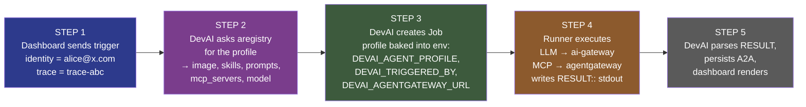
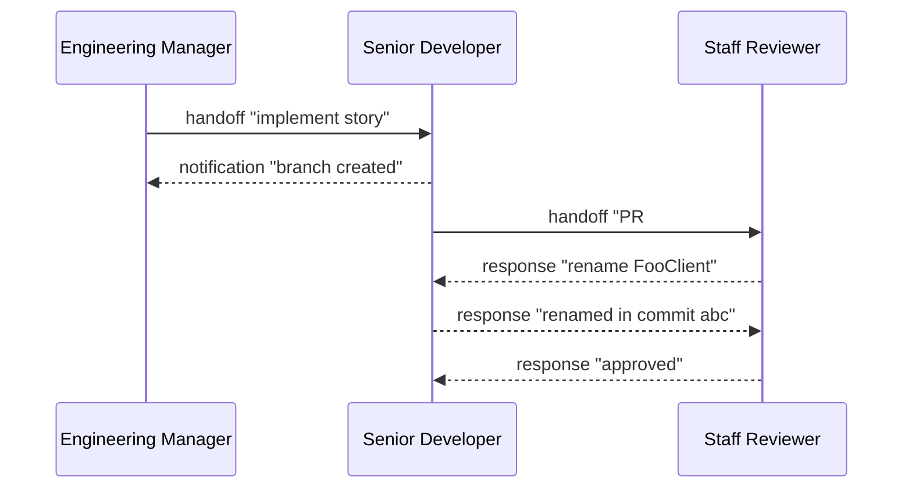
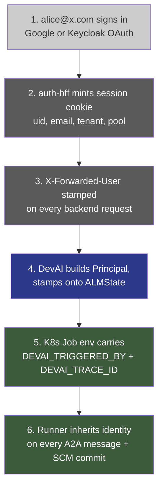

# DevAI ↔ aregistry ↔ agentgateway — End-to-End Integration

This document describes how DevAI maps a reviewed product capability to one canonical
agent, resolves its complete composition from **Agentic Registry**, runs it with
Tesserix ADK, and sends model, MCP, and outbound A2A traffic through the approved
gateways. The same admission rules apply to in-process A2A and Kubernetes Job runs.

Publishing and release operations are covered separately in
[Publishing DevAI agents to the Agent Registry](AGENT-REGISTRY-PUBLISHING.md).
Cross-product caller and hosted-capability admission is covered in
[Global ADK runtime onboarding](../guides/global-adk-runtime.md).

Diagrams are provided in two formats:

- **Mermaid blocks** below render natively on GitHub / GitLab / VS Code.
- **`.drawio` files** in `diagrams/` open directly in [drawio](https://app.diagrams.net) /
  the VS Code Drawio extension — use these to edit the diagrams.

---

## 1. Component topology

```mermaid
flowchart LR
    User([User])
    DevAI[DevAI API<br/>blueprint executor<br/>+ dispatcher]
    Reg[Agent Registry<br/>catalog of<br/>agents · skills · MCP · prompts]
    Runner[Runner Pod<br/>ephemeral K8s Job]
    AIGW[AI Gateway<br/>LLM proxy<br/>Anthropic · OpenAI]
    AGW[Agent Gateway<br/>MCP + A2A policy<br/>solo.io]
    Peer[Admitted product agent]
    ADK[Global ADK Runtime<br/>warm HA pool]
    LLM[/Anthropic · OpenAI/]
    MCP[/MCP servers/]

    User    -- 1. trigger --> DevAI
    DevAI   -- 2. /resolved --> Reg
    Reg     -. validated bundle .-> DevAI
    DevAI   -- 3. create Job<br/>(profile in env) --> Runner
    Runner  -- 4. LLM call --> AIGW
    Runner  -- 5. MCP call --> AGW
    Peer    -- authenticated A2A --> AGW
    AGW     -- /a2a/v1 --> ADK
    ADK     -- governed /resolved --> Reg
    AIGW    --> LLM
    AGW     --> MCP
    Runner  -. 6. RESULT:: .-> DevAI

    style DevAI fill:#2d3a8c,color:#fff
    style Reg   fill:#7a3d8c,color:#fff
    style Runner fill:#3d5a3d,color:#fff
    style AIGW  fill:#8c5a2d,color:#fff
    style AGW   fill:#8c5a2d,color:#fff
    style ADK   fill:#2d3a8c,color:#fff
```

### Component roles

| Component | Namespace | Port | Job |
|---|---|---|---|
| **devai-api** | `devai` | 8080 | FastAPI app: trigger handlers, blueprint executor, JobRunnerStage dispatcher |
| **devai-runner** | `devai` | — | Ephemeral Job pods. One per stage. Reads `DEVAI_AGENT_PROFILE` from env. |
| **devai-dashboard** | `devai` | 3100 | Next.js UI |
| **auth-bff** | `devai` | 8090 | Terminates OAuth, stamps `X-Forwarded-User/Uid/Tenant` |
| **agentregistry (aregistry)** | `agentregistry-system` | 12121 | Catalog. `/v0/{agents,skills,prompts,servers,health}`. pgvector for semantic search. |
| **agentgateway-mcp** | `agentgateway-system` | 8080 | Shared internal data plane. Routes approved `/mcp/{name}` traffic and authenticated `/a2a/v1/*` calls. |
| **adk-runtime** | `devai` | 8080 | Stable backend alias for the HA warm runtime pool. Consumers never call it directly. |
| **ai-gateway** | `agentgateway-system` | 8080 | Provider data plane for governed model calls only. |
| **kagent** | `kagent-system` | 8083 | Agent lifecycle controller (solo.io). Reconciles agents labelled `devai.io/runtime=kagent` into Deployments; the dispatcher routes those over A2A (all other agents stay Job-dispatched). |

→ Edit: [`diagrams/01-component-topology.drawio`](diagrams/01-component-topology.drawio)

---

## 2. The "spin up an agent" flow

Five clean steps from user click to running agent.



> **Key insight:** Registry is an execution dependency, not a hint. Dispatch resolves
> the exact canonical Agent before creating a Job, and the runner revalidates a fresh
> composition at its own execution boundary. Either failure stops before model/tool use.

### What each step gets right

| Step | Source-of-truth | Code |
|---|---|---|
| Identity at boundary | auth-bff `X-Forwarded-User` | `services/auth-bff/internal/proxy/proxy.go:92-95` |
| Identity in pipeline | `Principal` on `ALMState` / `DevAITask` | `src/devai/identity.py`, `src/devai/graph/state.py:62-70` |
| Agent composition resolution | Agentic Registry `/v0/agents/{name}/resolved` | `src/devai/pipeline/stages/job_runner.py:_fetch_agent_profile` |
| Image selection | per-stack → profile → default | `_resolve_image` |
| Profile delivery to runner | `DEVAI_AGENT_PROFILE` env | `src/devai/runtime/job_spec.py:96-128` |
| Runtime admission | reviewed local contract + fresh Registry composition | `src/devai/specializations/service.py:resolve_governed` |
| LLM dispatch | mandatory AI Gateway in governed mode | `DEVAI_LLM_GATEWAY_REQUIRED`, `DEVAI_LLM_GATEWAY_BASE_URL` |
| MCP dispatch | mandatory agentgateway when the bundle declares MCP Servers | `DEVAI_AGENTGATEWAY_URL` |
| Job completion | structured `RESULT::` line parsed from stdout | `_parse_runner_result` |

→ Edit: [`diagrams/02-spinup-flow.drawio`](diagrams/02-spinup-flow.drawio)

---

## 2a. How DevAI knows which agent and which MCP to use — in plain English

There are three questions to answer, and **three different things answer them**.
Each one has a single owner; they never overlap.

### Question 1 — "Which agent should run at this step?"

**Answered by reviewed product mapping.** A blueprint names a reviewed capability for
workflow steps. Direct product callers use
`POST /a2a/v1/capabilities/{capability}`. Both map deterministically to exactly one
canonical Registry name (`senior_developer` → `senior-developer-agent`); DevAI does not
choose the first fuzzy Agent Card match.

```yaml
# blueprints/app-scaffold.yaml
- name: scaffold_app
  stage: run_as_job
  config:
    agent: senior_developer    # ← the blueprint picks the agent
```

When DevAI reaches `scaffold_app`, it reads `senior_developer`, verifies that capability
is in the shipped admission catalog, and resolves only `senior-developer-agent`.

### Question 2 — "What does that agent need to do its job?"

**Answered by the Agent Registry (aregistry).** Aregistry is a catalog. For
every agent, it stores a record like a business card:

| Field | Example |
|---|---|
| name | senior-developer-agent |
| image | `ghcr.io/tesserix/devai/devai-runner:main` |
| model | anthropic / claude-sonnet-4 |
| skills | code_review, git_workflow, testing |
| prompts | implement_story, refactor |
| **mcp_servers** | **scm-mcp, devai-mcp** |

DevAI calls the Registry resolution endpoint:

```
DevAI → aregistry: GET /v0/agents/senior-developer-agent/resolved
aregistry → DevAI: { agent, resolved: {skills, tools, mcpServers, prompts}, unresolved }
```

DevAI rejects any unresolved reference or drift from the reviewed Skill, Prompt, risk,
tool, output, and handover contracts. Job metadata carries the dispatch snapshot, and
the runner performs fresh admission before execution so a stale snapshot cannot bypass
revocation.

### Question 3 — "Where do those MCP servers actually live?"

**Answered by aregistry again.** The agent's card lists MCP server *names*,
not URLs. The runner asks aregistry for each name:

```
runner → aregistry: "where is scm-mcp?"
aregistry → runner: "http://devai-api.devai.svc.cluster.local:8080/mcp/scm"
```

The runner replaces backing-service URLs with the configured Agent Gateway route:

```
http://agentgateway-mcp.agentgateway-system.svc.cluster.local:8080/mcp/scm-mcp
```

In governed mode an absent MCP gateway is an error before agent execution. Direct MCP
fallback remains only for explicitly non-governed local development.

### One-paragraph summary

> The reviewed capability mapping picks **which canonical agent** may run.
> Registry `/resolved` supplies **what Skill, Prompt, Tool, and MCP artifacts** compose it.
> The gateways enforce **how every outbound call flows** once admitted.

So:

> **Reviewed mapping = which agent. Registry = exact composition.
> Gateways = the only approved data plane.**

### AI provider routing standard

Every product configures an ordered LLM chain. The product primary is always attempted first;
agent/model preferences only select the equivalent model tier on that provider. A failure moves
to the configured secondary and every attempt uses that provider's dedicated Solo.io AI Gateway
route. In production `LLM_GATEWAY_REQUIRED` is fail-closed, so a gateway outage never falls back
to direct vendor egress. DevAI's production chain is Vertex Gemini → Anthropic. See
`docs/adr/0006-agent-gateway-provider-priority.md` for the reusable product contract.

### Worked example — `senior_developer` on a Next.js scaffold

1. Blueprint `app-scaffold.yaml` says step `scaffold_app` runs
   `agent: senior_developer`.
2. DevAI resolves `senior-developer-agent` and rejects an incomplete or drifted bundle.
3. DevAI picks a runner image — for this step, the per-stack default
   (`devai-runner-nextjs:main`) wins over what's on the card.
4. DevAI creates a K8s Job. The Job's env carries the full card as JSON, plus
   the gateway URL.
5. The runner pod boots and revalidates the canonical Registry bundle.
6. Registry MCP references become Agent Gateway routes; an absent gateway fails closed.
7. The agent runs: LLM calls flow through the AI Gateway and MCP calls through
   Agent Gateway. There is no direct-provider retry in governed mode.
8. The pod prints `RESULT::{...}` and exits. DevAI picks up the result and
   moves to the next blueprint step.

### Who changes what?

| If you want to… | Edit… |
|---|---|
| Add a new step to a workflow | a blueprint YAML in `blueprints/` |
| Swap which agent runs at a step | the `config.agent` field of that blueprint step |
| Give an agent access to a new MCP server | the agent's seed in `architecture/registry-seeds/agents/` |
| Add a new MCP server entirely | drop a YAML in `architecture/registry-seeds/mcp-servers/` |
| Route all MCP traffic through the gateway | set `DEVAI_AGENTGATEWAY_URL` in `tesserix-k8s` |

---

## 3. A2A protocol — agent-to-agent handover

Do not confuse the in-run message bus below with the cluster-global A2A
transport. An admitted product agent invokes a hosted capability at
`http://agentgateway-mcp.agentgateway-system.svc.cluster.local:8080/a2a/v1/...`.
AgentGateway verifies Zitadel and the `agentgateway.runtime` role, overwrites
workload identity headers, and forwards to the `adk-runtime` alias with a
dedicated upstream bearer. Direct access to the backend is not supported.

DevAI agents collaborate via a small typed protocol. Six message types
(`request`, `response`, `notification`, `handoff`, `escalation`, `broadcast`)
flow on a per-run **A2A bus** that's just a list on `ALMState["a2a_messages"]`.
Every message carries the originating user (`triggered_by`) and a `trace_id`
so audit can answer "who asked for this and what work was correlated".

### Message envelope

```json
{
  "id": "01H...",
  "from_agent": "senior_developer",
  "to_agent":   "staff_reviewer",
  "message_type": "handoff",
  "subject": "Story #3 ready for review",
  "body":    "PR #42 implements the pagination API.",
  "payload": {"pr_number": 42, "story_index": 3},
  "in_reply_to": null,
  "timestamp": "2026-05-26T10:42:11Z",
  "triggered_by": "alice@x.com",
  "trace_id":     "trace-abc"
}
```

### Handover flow



All six message types — `request`, `response`, `handoff`, `notification`,
`escalation`, `broadcast` — flow through the same `A2ABus.send()`. Every
message is persisted to Redis at `devai:run:{run_id}:a2a_messages` with
a 30-day TTL so the audit trail can be replayed.

### How identity propagates onto every message

The A2A bus is constructed *once per agent* with the run-level identity:

```python
# src/devai/core/base_agent.py:124-141
principal     = state.get("principal") or {}
triggered_by  = state.get("trigger_actor") or principal.get("email", "")
trace_id      = state.get("trace_id", "")
a2a = A2ABus(self.name, state.get("a2a_messages", []),
             triggered_by=triggered_by, trace_id=trace_id)
```

…and `send()` stamps both fields on every outbound message:

```python
# src/devai/graph/a2a.py:send
msg = {...}
if self.triggered_by: msg["triggered_by"] = self.triggered_by
if self.trace_id:     msg["trace_id"]     = self.trace_id
```

Result: an individual agent's code calls `a2a.handoff(...)`, `a2a.request(...)`,
etc. and **never has to remember to set identity** — the bus inherits it from
the state.

→ Edit: [`diagrams/03-a2a-protocol.drawio`](diagrams/03-a2a-protocol.drawio)

---

## 4. Identity propagation in full

Six hops from sign-in to attributed agent action.



The result: every agent action and every A2A message is attributable to
the originating user. Audit replay by `triggered_by` or `trace_id` works
end-to-end.

→ Edit: [`diagrams/04-identity-flow.drawio`](diagrams/04-identity-flow.drawio)

---

## 5. End-to-end smoke test (what "working" looks like)

The integration is healthy when **every one** of these holds:

| # | Check | How to verify |
|---|---|---|
| 1 | aregistry reachable | `kubectl exec -n agentregistry-system deploy/agentregistry -- curl -s http://localhost:8080/v0/health` returns `{ok:true}` (aregistry is internal-only — no public hostname) |
| 2 | dashboard shows correct counts | `/dashboard/registry` shows 8 tiles populated |
| 3 | trigger a run as alice@x.com | `POST /api/pipeline/trigger` returns `triggered_by:"alice@x.com"` |
| 4 | dispatch fetches profile | API logs: `registry.get_agent(senior_developer)` returns full record |
| 5 | Job env carries profile | `kubectl describe job <name>` shows `DEVAI_AGENT_PROFILE` non-empty |
| 6 | Runner uses profile, not re-fetch | runner logs: `agent profile resolved … from env` |
| 7 | LLM call hits ai-gateway | nginx access log on `ai-gateway` shows `/anthropic/v1/messages 200` |
| 8 | MCP call hits agentgateway when set | runner logs: `mcp endpoints routed_via=agentgateway` |
| 9 | A2A messages carry identity | `redis-cli LRANGE devai:run:<id>:a2a_messages 0 -1 \| jq '.[0].triggered_by'` → `"alice@x.com"` |
| 10 | Dashboard timeline attributes | `/runs/<id>` Timeline tab shows alice@x.com on each message |
| 11 | global card requires a machine token | authenticated `GET` through `agentgateway-mcp:8080/.well-known/agent-card.json` succeeds; a request without the token returns 401 |
| 12 | global A2A reaches the warm pool | authenticated `message/send` through `agentgateway-mcp:8080/a2a/v1/capabilities/<name>` succeeds and the access log contains verified subject and client id |
| 13 | HA floor is present | three `devai-api` replicas are ready in separate zones and the PDB has `minAvailable: 2` |

If any of 1-13 regresses, the chain breaks silently — runs still complete, but the
identity / control-plane wiring degrades to "system" attribution.

---

## 6. Open work

| Status | Item |
|---|---|
| ✅ Done | **kagent dispatch (opt-in, per-agent).** `JobRunnerStage` routes an agent over A2A through the kagent controller when its registry record carries `devai.io/runtime=kagent` and `DEVAI_KAGENT_URL` is set; otherwise it dispatches a K8s Job. Definite pre-acceptance failures use the Job path; accepted or ambiguous outcomes fail closed to prevent duplicate tool calls. `kagent-agent-sync` reconciles the same labelled agents into Deployments. See `src/devai/pipeline/stages/job_runner.py::_maybe_dispatch_kagent` + `src/devai/agentic/kagent_client.py` |
| ✅ Done | **Dynamic on/off switch.** kagent is a `kagent` connector in the Settings catalog (`settings/models.py`, provider `on`/`off` → `kagent_enabled`, plus optional controller URL/namespace fields). Resolved per run through `build_overlay` with full scope precedence (user → team → org → tenant → global → `DEVAI_KAGENT_ENABLED` base), so toggling it lands on the next run with **no restart**. The Settings UI renders it automatically from the catalog. `JobRunnerStage._kagent_settings` reads the overlay before dispatch. |
| ⚠️ Caveat | Confirm the kagent controller's A2A `message/send` contract in-cluster before labelling a hot-path agent — the result-shape parsing in `extract_a2a_text` is defensive but unverified against the live 0.9.7 controller |
| ✅ Done | **AgentGateway MCP and global A2A routes.** Registry-owned MCP routes and the authenticated global runtime route are rendered by `tesserix-k8s/charts/apps/agentgateway-route-sync`; governed production traffic has no direct-service fallback. |
| ✅ Done | Aregistry profile injection into Job env (this PR) |
| ✅ Done | Identity propagation end-to-end (prior PR) |
| ✅ Done | MCP endpoint resolver with agentgateway fallback (this PR) |
