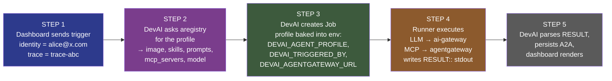
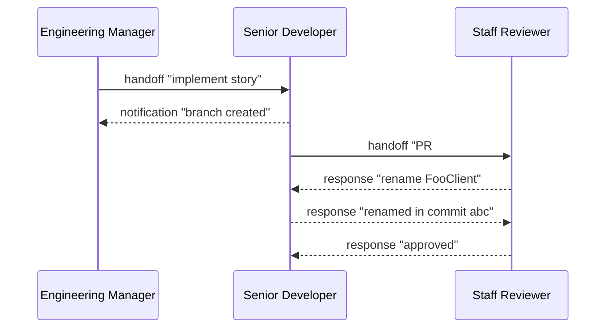
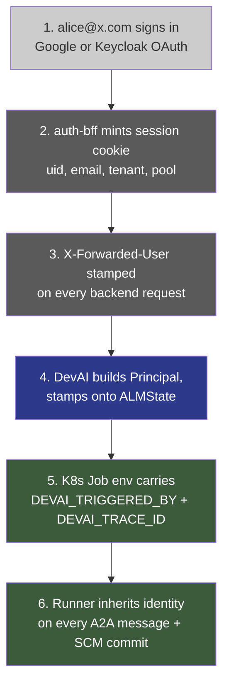

# DevAI ↔ aregistry ↔ agentgateway — End-to-End Integration

This document describes how a user-triggered task in DevAI fetches the right agent
definition from the **Agent Registry**, dispatches it through the **Agent Gateway**,
runs it as a Kubernetes Job, and uses the **A2A (Agent-to-Agent) protocol** for
inter-agent handoffs.

Diagrams are provided in two formats:

- **Mermaid blocks** below render natively on GitHub / GitLab / VS Code.
- **`.drawio` files** in `diagrams/` open directly in [drawio](https://app.diagrams.net) /
  the VS Code Drawio extension — use these to edit the diagrams.

---

## 1. Component topology

Six boxes, one user. That's it.

```mermaid
flowchart LR
    User([User])
    DevAI[DevAI API<br/>blueprint executor<br/>+ dispatcher]
    Reg[Agent Registry<br/>catalog of<br/>agents · skills · MCP · prompts]
    Runner[Runner Pod<br/>ephemeral K8s Job]
    AIGW[AI Gateway<br/>LLM proxy<br/>Anthropic · OpenAI]
    AGW[Agent Gateway<br/>MCP dispatch<br/>solo.io]
    LLM[/Anthropic · OpenAI/]
    MCP[/MCP servers/]

    User    -- 1. trigger --> DevAI
    DevAI   -- 2. get_agent --> Reg
    Reg     -. profile .-> DevAI
    DevAI   -- 3. create Job<br/>(profile in env) --> Runner
    Runner  -- 4. LLM call --> AIGW
    Runner  -- 5. MCP call --> AGW
    AIGW    --> LLM
    AGW     --> MCP
    Runner  -. 6. RESULT:: .-> DevAI

    style DevAI fill:#2d3a8c,color:#fff
    style Reg   fill:#7a3d8c,color:#fff
    style Runner fill:#3d5a3d,color:#fff
    style AIGW  fill:#8c5a2d,color:#fff
    style AGW   fill:#8c5a2d,color:#fff
```

### Component roles

| Component | Namespace | Port | Job |
|---|---|---|---|
| **devai-api** | `devai` | 8080 | FastAPI app: trigger handlers, blueprint executor, JobRunnerStage dispatcher |
| **devai-runner** | `devai` | — | Ephemeral Job pods. One per stage. Reads `DEVAI_AGENT_PROFILE` from env. |
| **devai-dashboard** | `devai` | 3100 | Next.js UI |
| **auth-bff** | `devai` | 8090 | Terminates OAuth, stamps `X-Forwarded-User/Uid/Tenant` |
| **agentregistry (aregistry)** | `agentregistry-system` | 12121 | Catalog. `/v0/{agents,skills,prompts,servers,health}`. pgvector for semantic search. |
| **agentgateway** | `agentgateway-system` | 9092 | solo.io MCP dispatch gateway. Routes `/mcp/{name}` → backend MCP server. |
| **ai-gateway** | `agentgateway-system` | 8080 | nginx LLM proxy. Routes `/anthropic/*` + `/openai/*` to public APIs, injects API keys server-side. |
| **kagent** | `kagent-system` | 8083 | Agent lifecycle controller (solo.io). Deployed; **not yet** wired into pipeline. |

→ Edit: [`diagrams/01-component-topology.drawio`](diagrams/01-component-topology.drawio)

---

## 2. The "spin up an agent" flow

Five clean steps from user click to running agent.



> **Key insight:** the aregistry call happens **once** per dispatch (step 2).
> The runner reads its profile from env vars baked into the Job by DevAI in step 3 —
> it does **not** re-query aregistry on boot.

### What each step gets right

| Step | Source-of-truth | Code |
|---|---|---|
| Identity at boundary | auth-bff `X-Forwarded-User` | `services/auth-bff/internal/proxy/proxy.go:92-95` |
| Identity in pipeline | `Principal` on `ALMState` / `DevAITask` | `src/devai/identity.py`, `src/devai/graph/state.py:62-70` |
| Agent profile resolution | aregistry single round-trip per dispatch | `src/devai/pipeline/stages/job_runner.py:_fetch_agent_profile` |
| Image selection | per-stack → profile → default | `_resolve_image` |
| Profile delivery to runner | `DEVAI_AGENT_PROFILE` env | `src/devai/runtime/job_spec.py:96-128` |
| Profile consumption | env-first, aregistry only on env miss | `src/devai/runner/entrypoint.py:_decode_agent_profile_from_env` |
| LLM dispatch | ai-gateway (keys injected server-side) | `DEVAI_ANTHROPIC_BASE_URL` in `values-prod.yaml` |
| MCP dispatch | agentgateway when `DEVAI_AGENTGATEWAY_URL` set; direct otherwise | `_resolve_mcp_endpoints` |
| Job completion | structured `RESULT::` line parsed from stdout | `_parse_runner_result` |

→ Edit: [`diagrams/02-spinup-flow.drawio`](diagrams/02-spinup-flow.drawio)

---

## 3. A2A protocol — agent-to-agent handover

DevAI agents collaborate via a small typed protocol. Six message types
(`request`, `response`, `notification`, `handoff`, `escalation`, `broadcast`)
flow on a per-run **A2A bus** that's just a list on `ALMState["a2a_messages"]`.
Every message carries the originating user (`triggered_by`) and a `trace_id`
so audit can answer "who asked for this and what work was correlated".

### Message envelope

```json
{
  "id": "01H...",
  "from_agent": "senior_developer",
  "to_agent":   "staff_reviewer",
  "message_type": "handoff",
  "subject": "Story #3 ready for review",
  "body":    "PR #42 implements the pagination API.",
  "payload": {"pr_number": 42, "story_index": 3},
  "in_reply_to": null,
  "timestamp": "2026-05-26T10:42:11Z",
  "triggered_by": "alice@x.com",
  "trace_id":     "trace-abc"
}
```

### Handover flow



All six message types — `request`, `response`, `handoff`, `notification`,
`escalation`, `broadcast` — flow through the same `A2ABus.send()`. Every
message is persisted to Redis at `devai:run:{run_id}:a2a_messages` with
a 30-day TTL so the audit trail can be replayed.

### How identity propagates onto every message

The A2A bus is constructed *once per agent* with the run-level identity:

```python
# src/devai/core/base_agent.py:124-141
principal     = state.get("principal") or {}
triggered_by  = state.get("trigger_actor") or principal.get("email", "")
trace_id      = state.get("trace_id", "")
a2a = A2ABus(self.name, state.get("a2a_messages", []),
             triggered_by=triggered_by, trace_id=trace_id)
```

…and `send()` stamps both fields on every outbound message:

```python
# src/devai/graph/a2a.py:send
msg = {...}
if self.triggered_by: msg["triggered_by"] = self.triggered_by
if self.trace_id:     msg["trace_id"]     = self.trace_id
```

Result: an individual agent's code calls `a2a.handoff(...)`, `a2a.request(...)`,
etc. and **never has to remember to set identity** — the bus inherits it from
the state.

→ Edit: [`diagrams/03-a2a-protocol.drawio`](diagrams/03-a2a-protocol.drawio)

---

## 4. Identity propagation in full

Six hops from sign-in to attributed agent action.



The result: every agent action and every A2A message is attributable to
the originating user. Audit replay by `triggered_by` or `trace_id` works
end-to-end.

→ Edit: [`diagrams/04-identity-flow.drawio`](diagrams/04-identity-flow.drawio)

---

## 5. End-to-end smoke test (what "working" looks like)

The integration is healthy when **every one** of these holds:

| # | Check | How to verify |
|---|---|---|
| 1 | aregistry reachable | `curl https://aregistry.tesserix.app/v0/health` returns `{ok:true}` |
| 2 | dashboard shows correct counts | `/dashboard/registry` shows 8 tiles populated |
| 3 | trigger a run as alice@x.com | `POST /api/pipeline/trigger` returns `triggered_by:"alice@x.com"` |
| 4 | dispatch fetches profile | API logs: `registry.get_agent(senior_developer)` returns full record |
| 5 | Job env carries profile | `kubectl describe job <name>` shows `DEVAI_AGENT_PROFILE` non-empty |
| 6 | Runner uses profile, not re-fetch | runner logs: `agent profile resolved … from env` |
| 7 | LLM call hits ai-gateway | nginx access log on `ai-gateway` shows `/anthropic/v1/messages 200` |
| 8 | MCP call hits agentgateway when set | runner logs: `mcp endpoints routed_via=agentgateway` |
| 9 | A2A messages carry identity | `redis-cli LRANGE devai:run:<id>:a2a_messages 0 -1 \| jq '.[0].triggered_by'` → `"alice@x.com"` |
| 10 | Dashboard timeline attributes | `/runs/<id>` Timeline tab shows alice@x.com on each message |

If any of 1-10 regresses, the chain breaks silently — runs still complete, but the
identity / control-plane wiring degrades to "system" attribution.

---

## 6. Open work

| Status | Item |
|---|---|
| ⚠️ Deferred | **kagent dispatch.** Currently deployed but devai dispatches Jobs directly to the K8s API. Wiring kagent as the agent lifecycle controller is future work — see `docs/deploy/CONTROL-PLANES.md` |
| ⚠️ Deferred | **agentgateway provider backends.** The gateway is in the topology but solo.io's MCP routing rules are not configured for our specific MCP servers — currently `routed_via=agentgateway` produces a URL that resolves on path but agentgateway's MCP backend resolution is still TODO in `tesserix-k8s/charts/apps/agentgateway` |
| ✅ Done | Aregistry profile injection into Job env (this PR) |
| ✅ Done | Identity propagation end-to-end (prior PR) |
| ✅ Done | MCP endpoint resolver with agentgateway fallback (this PR) |
