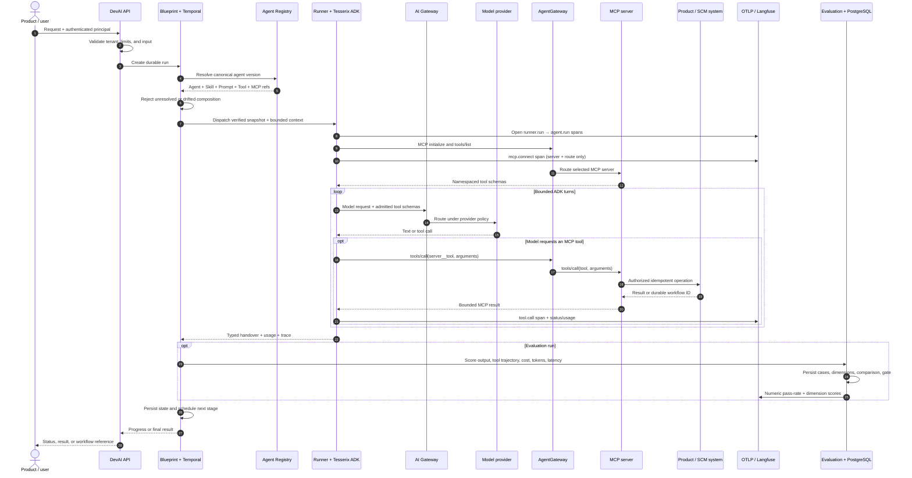

# Product → DevAI agent → MCP: the complete journey

This is the simplest accurate view of how a product asks DevAI to do work, how DevAI
constructs an agent, and how that agent reaches models and tools. The editable companion
is [`diagrams/05-product-agent-mcp-journey.drawio`](diagrams/05-product-agent-mcp-journey.drawio).

## The whole system in one picture

```mermaid
flowchart LR
    Product[Product or user<br/>UI · API · webhook]

    subgraph Control[DevAI control plane]
        API[DevAI API<br/>authenticate · validate · create run]
        Flow[Blueprint + Temporal<br/>choose stage · persist progress]
        Registry[Agent Registry<br/>agent · skill · prompt · tool<br/>MCP server · version]
        Eval[Evaluation service<br/>deterministic + judge scorers<br/>quality gates]
    end

    subgraph Runtime[One agent execution]
        Runner[Runner pod<br/>verified composition snapshot]
        ADK[Tesserix ADK<br/>model/tool loop + budgets]
        Context[Prompt context<br/>task · repo · prior stages<br/>memory · user settings]
    end

    subgraph Gateways[Policy gateways]
        AIGW[AI Gateway<br/>model policy + routing]
        MCPGW[AgentGateway<br/>MCP authz · routing · telemetry]
    end

    subgraph Capabilities[Capability systems]
        Models[Model providers]
        MCP[MCP servers<br/>SCM · DevAI · SRE · product]
        Systems[Owning systems<br/>GitHub · APIs · PostgreSQL<br/>Temporal · object storage]
    end

    subgraph Observe[Quality and observability]
        EvalDB[(PostgreSQL<br/>evaluation source of truth)]
        Langfuse[OTLP + Langfuse<br/>traces · spans · metrics · scores]
        UI[DevAI observability UI<br/>run timeline · scorecards<br/>trace deep links]
    end

    Product -- "1  request + identity" --> API
    API -- "2  start durable run" --> Flow
    Flow -- "3  resolve exact version" --> Registry
    Registry -. "agent + skills + prompts<br/>tool and MCP references" .-> Flow
    Flow -- "4  dispatch signed snapshot" --> Runner
    Context --> ADK
    Runner --> Context
    Runner --> ADK
    ADK -- "5a  model request" --> AIGW --> Models
    ADK -- "5b  tools/list + tools/call" --> MCPGW --> MCP --> Systems
    ADK -. "6  typed result + trace" .-> Flow
    Flow -. "7  status/result" .-> API -.-> Product
    ADK -- "correlated runner · agent<br/>model · MCP · tool spans" --> Langfuse
    Flow -. "evaluation inputs" .-> Eval
    Eval -- "durable run + case scores" --> EvalDB
    Eval -- "aggregate + dimension scores" --> Langfuse
    EvalDB --> UI
    Langfuse --> UI

    classDef product fill:#f3f4f6,stroke:#4b5563,color:#111827
    classDef control fill:#312e81,stroke:#1e1b4b,color:#fff
    classDef registry fill:#6b21a8,stroke:#4c1d95,color:#fff
    classDef runtime fill:#166534,stroke:#14532d,color:#fff
    classDef gateway fill:#9a3412,stroke:#7c2d12,color:#fff
    classDef external fill:#fff,stroke:#6b7280,color:#111827,stroke-dasharray: 5 5
    classDef observe fill:#0f766e,stroke:#134e4a,color:#fff
    class Product product
    class API,Flow control
    class Registry registry
    class Runner,ADK,Context runtime
    class AIGW,MCPGW gateway
    class Models,MCP,Systems external
    class Eval,EvalDB,Langfuse,UI observe
```

The important separation is:

- **Agent Registry says what may run.** It owns versioned agent, Skill, Prompt, Tool,
  and MCP Server metadata.
- **DevAI supplies request context.** Task data, repository state, prior-stage handovers,
  memory, attachments, and the principal's settings become the bounded prompt context.
- **Tesserix ADK runs the loop.** It presents only admitted local and MCP tools, enforces
  iteration/token/time budgets, validates typed output, and records the trace.
- **Gateways say how calls leave the runner.** AI Gateway routes model calls;
  AgentGateway applies MCP policy and routes `tools/list` and `tools/call` to the selected
  server. A gateway does not own Skills or conversation context.
- **Owning systems keep durable truth.** Product APIs and PostgreSQL own mutations and
  idempotency; Temporal owns long-running workflow history. The MCP pod owns neither.
- **Observability connects evidence.** Runner, agent, model, MCP connection, and tool-call
  spans share safe run/trace identifiers. Evaluation cases remain durable in PostgreSQL;
  aggregate and per-dimension numeric scores are also exported to Langfuse. The DevAI UI
  presents scorecards and links investigators to the external trace without storing prompts,
  tool arguments, tool results, credentials, or other sensitive payloads in telemetry.

## One request, step by step

## Where Skills, tools, and context come from

| Item | Owner | What reaches the runner |
|---|---|---|
| Agent | Reviewed capability mapping + Agent Registry | Canonical name, version, runtime, model policy, budgets |
| Skill | Agent Registry, checked against the reviewed local contract | Allowed tool names, context keys, output key, handover schema |
| Prompt | Agent Registry, checked by content hash | System prompt and user-prompt template |
| Local tool | DevAI `ToolDispatcher` | Schema and a request-scoped handler |
| MCP tool | Selected MCP Server through AgentGateway | Runtime `tools/list` schema, exposed as `server__tool` |
| Context | Product request and earlier stages | Only declared context keys plus task/repository identity |
| Memory | Principal-scoped memory adapter | Relevant recalled records; absence degrades without changing authority |
| User settings | Principal settings overlay | Approved model, SCM, MCP, and connector choices |

MCP tool names are namespaced, for example `scm-mcp__scm_read_file`. The prefix makes
two servers with the same wire-level tool name unambiguous. The ADK removes the prefix
when it sends the call to the selected MCP server.

## Why the MCP runtime is stateless

Every MCP call carries or derives its complete authority: tenant, identity, tool and
schema version, request/trace ID, deadline, and an idempotency key for mutations. Any
healthy replica can serve the next call. A pod may keep only disposable counters,
cancellation handles, telemetry buffers, and bounded caches.

Durable state belongs elsewhere:

| Concern | Durable owner |
|---|---|
| Pipeline and long-running agent progress | Temporal |
| DevAI runs, approvals, audit, and handovers | PostgreSQL |
| Product mutation and idempotency result | Product API / its PostgreSQL database |
| Capability versions and activation state | Agent Registry |
| Repository changes and CI evidence | SCM provider |
| Large generated artifacts | Object storage |

This gives at-least-once delivery with idempotent effects—not a false exactly-once
claim. Repeating a mutation with the same tenant-scoped key returns the original result;
reusing the key for different input is a conflict.

## What investigators can see

Each runner installs the configured telemetry adapter before invoking the ADK and flushes it
before exit. The nested trace is `runner.run → agent.run → model/tool activity`, with
`mcp.connect` and `tool.call` spans for remote capabilities. Safe attributes include run ID,
trace ID, stage, agent, MCP server, transport/route, tool name, status, model/tool-call counts,
and token totals. OpenTelemetry provides timestamps, duration, and error status.

Evaluation is a separate, durable quality record. Built-in scorers cover exact/regex/schema
output, expected tools and trajectories, task completion, latency, tokens, cost, and pinned
judge dimensions. PostgreSQL remains authoritative for cases, comparisons, and release gates;
Langfuse receives the evaluation trace plus numeric pass-rate and dimension scores. The DevAI
evaluation/comparison panels read the durable API, while Analytics exposes provider health and
trace deep links. This separation means losing telemetry never loses an evaluation or blocks an
agent run.

## Failure behavior

| Failure | Expected behavior |
|---|---|
| Registry unavailable before dispatch | Fail closed; do not start a governed agent |
| Composition contains unresolved or changed references | Reject before model or tool use |
| AI Gateway or model unavailable | Bounded retry by the configured owner, then stable failure |
| Required MCP server unavailable | Fail the agent execution; do not silently remove its capability |
| One MCP call fails | Return a bounded tool error to the ADK loop; no secret-bearing arguments are logged |
| Runner pod disappears | Temporal retries/resumes; durable state remains outside the pod |
| Duplicate mutation delivery | Owning product returns the stored idempotent result |
| AgentGateway route is revoked | Fresh MCP connection fails closed |

## Implementation map

| Responsibility | Source |
|---|---|
| Resolve and validate governed composition | `src/devai/specializations/service.py` |
| Carry the immutable composition into a runner | `src/devai/runner/entrypoint.py` |
| Build bounded prompt and request context | `src/devai/agentruntime/runner.py` |
| Run the ADK model/tool loop | `src/devai/agentruntime/tesserix.py` |
| Execute request-scoped local tools | `src/devai/tools/dispatch.py` |
| Connect, discover, and call MCP servers | `src/devai/mcphub/downstream.py` |
| Install and flush telemetry in runner Jobs | `src/devai/runner/entrypoint.py`, `src/devai/runtime/job_spec.py` |
| Persist and score evaluations | `src/devai/evaluations/`, `src/devai/sandbox/evals.py` |
| Export trace spans and evaluation scores | `src/devai/adapters/telemetry/` |
| Present scorecards, comparisons, and trace links | `dashboard/src/components/agent-evaluation-panel.tsx`, `dashboard/src/components/agent-comparison-panel.tsx` |
| Aggregate optional MCP Hub catalogs | `src/devai/mcphub/hub.py` |
| Authenticate and derive tenant identity | `src/devai/identity.py`, `services/auth-bff/` |
| Persist durable workflows | `src/devai/adapters/workflow/temporal.py` |
| Define GitOps gateway routes | `tesserix-k8s/charts/apps/agentgateway-route-sync/` |

## Production verification

Before calling the journey production-ready, verify all of these from an approved
GitOps deployment:

1. A product request retains the same tenant and trace ID through DevAI, the runner,
   AgentGateway, and the backing MCP server.
2. Registry resolution is exact and an unresolved Skill, Prompt, Tool, or MCP Server
   prevents execution.
3. The runner's first model request contains the expected namespaced MCP tool schemas.
4. MCP calls appear in AgentGateway telemetry and never dial a direct backend in governed mode.
5. Alternating requests across at least two MCP replicas requires no session affinity.
6. A duplicated mutating call produces one external effect and returns the original result.
7. Killing the runner during a durable operation allows Temporal to resume it.
8. A rollout drains accepted calls and routes new work to ready replicas.
9. One trace shows correlated `runner.run`, `agent.run`, `mcp.connect`, and `tool.call` spans
   with status and usage but no prompt, argument, result, user/email, or secret payload.
10. Evaluation cases persist in PostgreSQL, pass-rate/dimension scores appear in Langfuse, and
    the DevAI evaluation/comparison panels show the same run and gate result.
11. SLO, saturation, authorization-denial, and dependency-failure signals appear in dashboards.
12. The protected release candidate passes anonymous artifact and image verification.
