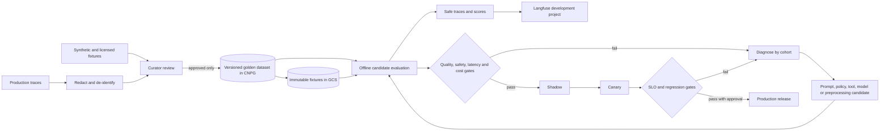

# OCR evaluation and improvement flywheel

## Boundary

The OCR dataset is a shared Document Intelligence asset. It is not a Kora dataset. Kora and other products may invoke the same tool from a DevAI sandbox, but verified workload configuration selects that product's development telemetry project and service identity. Dataset content, tool arguments and OCR text cannot select a product, tenant, environment, endpoint, provider, credential or trace destination.

CNPG is authoritative for dataset manifests, immutable versions, run metadata, review decisions and promotions. A dedicated non-production GCS bucket stores binary fixtures and evaluation artifacts. Langfuse receives safe trace/score metadata for exploration; it is neither the dataset source of truth nor the credential distributor. Agents never receive Langfuse keys.

## Capacity and service objectives

The launch corpus targets 10,000 reviewed pages, growing to 100,000 pages in 36 months. At an average 2 MiB source page plus derived artifacts, the initial object footprint is about 20 GiB and the 36-month footprint about 200 GiB before versioning. Offline runs admit at most 20 documents or 100 pages per second so evaluation cannot starve interactive service queues.

An evaluation release is valid only when every case has an immutable artifact generation and digest, all deterministic gates finish, and cohort metrics are computed. The evaluation control plane targets 99.9% monthly availability; an outage blocks promotion but never product OCR. Individual non-long-document cases have a 120-second ceiling. Promotion has no latency SLO because correctness and reproducibility are the priority.

The `ocr_quality` scorer reads the recorded `extract_document` tool result,
never the agent's prose. Where a reviewed case supplies the corresponding
expectation, it computes character and word error rates, field precision,
recall and F1, table-cell accuracy, classification accuracy, and citation
coverage. Its trace-safe detail contains only scores, counts, and stable error
codes—never reference text, extracted values, filenames, or signed URLs.

## Logical storage

Physical project, region and bucket names are GitOps review decisions. The logical resources are:

| Resource | Purpose | Access |
| --- | --- | --- |
| `ocr-eval-fixtures` | Reviewed immutable input images/PDFs | Dataset curator writes; evaluation runner reads |
| `ocr-eval-results` | Candidate outputs, diff artifacts and reports | Evaluation runner writes; reviewer reads |
| `ocr-model-sandbox` | Untrusted candidate weights and conversion outputs | Model-builder identity only |
| `ocr-model-candidates` | Signed candidates awaiting evaluation | Model-builder writes; evaluator reads |
| `ocr-model-releases` | Approved immutable production model artifacts | Release controller writes; runtime reads |

Object keys are content-addressed and never carry customer, tenant or filename data:

```text
datasets/ocr-agent/{dataset_version}/{cohort}/{artifact_digest}/{generation}
evaluations/{experiment_id}/results/{result_digest}
models/{model_name}/{model_version}/{artifact_digest}
```

Every bucket uses public-access prevention, uniform access, versioning, lifecycle rules, regional placement, malware scanning where applicable and Workload Identity. Evaluation identities have no access to product runtime buckets or product-specific Langfuse secrets. Production OCR identities cannot write golden datasets or model candidates.

## Execution and promotion



Production traces never train or enter a golden set automatically. Reviewed production provenance requires redaction and a governance reference. Prompt-injection text remains untrusted fixture data and is never promoted into system instructions.

## Versioned candidate manifest

Every run pins:

- agent name/version and immutable ADK version;
- system prompt, tool schema and policy versions;
- model, parameters, processing profile and calibration version;
- retrieval/index, memory and cache policy versions;
- dataset version plus every object generation and SHA-256 digest;
- deterministic scorer and judge rubric/model versions.

ADK `0.54.0` may be used only after its immutable release exists. A branch, commit without a release artifact or mutable container tag is not a valid compatibility pin.

## Trace contract

Every interaction records opaque agent, prompt, model, tool, policy, dataset, job and trace identifiers; model parameters; tool names/statuses; token counts; queue/provider/end-to-end latency; decimal cost; retries/errors; feedback and evaluation scores. Sampling keeps all failures and slow traces.

Trace attributes exclude raw OCR text, prompts containing document content, field values, filenames, signed URLs, access tokens, secrets and personal data. When a reviewed artifact is needed, the trace stores only its authorized immutable reference and digest.

## Promotion gates

The initial hard gates are:

- no critical safety or cross-product/tenant regression;
- structured-output validity at least 99%;
- required-tool accuracy at least 98%;
- evidence present for every extracted field;
- no material CER, WER, field-F1, table-cell or critical-field regression by document type/language/quality cohort;
- p95 latency within the Document Intelligence SLO and cost increase within the approved budget;
- deterministic checks on 100% of cases, deep evaluation on every failure and a reviewed random sample;
- shadow then canary before an approved production promotion.

Failed or unavailable optional systems degrade explicitly: Langfuse loss preserves canonical CNPG results; Qdrant loss disables semantic analysis; Valkey loss uses canonical stores; evaluation GCS loss blocks the run; CNPG loss blocks creation and promotion. None of these failures can change a production release automatically.
