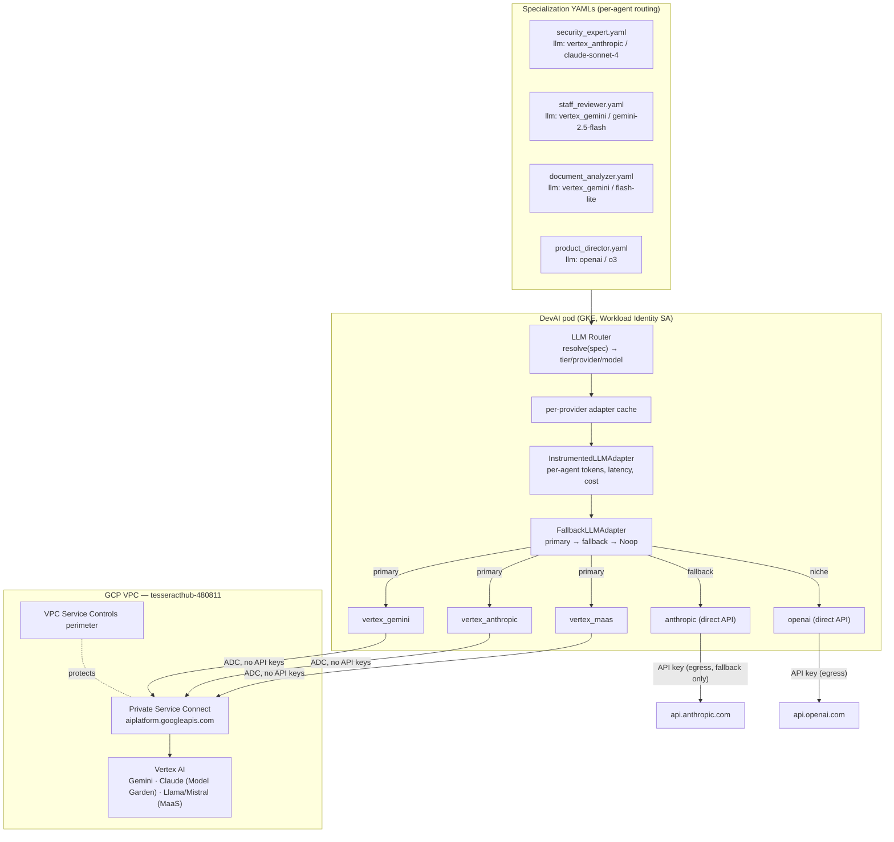
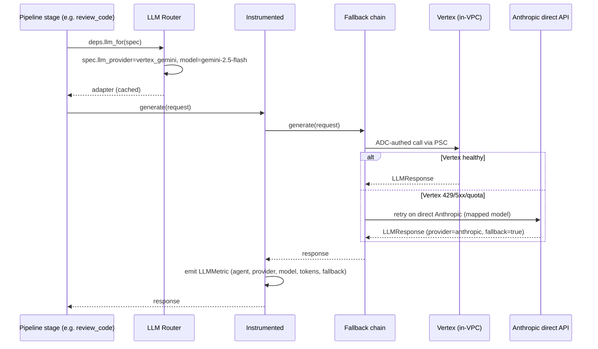

# Vertex AI Multi-Model Plan — Regulated, Per-Agent Model Routing

**Status:** Draft — 2026-06-12
**Goal:** Run DevAI's agent fleet on multiple models (Gemini, Claude, Llama/Mistral) through
**GCP Vertex AI as the primary, VPC-private inference plane**, with the **direct Anthropic API
as the fallback**. Each agent role picks the right-sized model (cheap/fast for reviews and
classification, frontier for implementation and security), declared in its specialization YAML —
no code changes to switch a role's model.

Diagrams: Mermaid inline below + `vertex-architecture.drawio` (page 1 = current, page 2 = target).

---

## 1. Current State (review)

### 1.1 What exists and is healthy

The **LLM adapter family** (`src/devai/adapters/llm/`) is exactly the seam Vertex plugs into:

| Piece | File | Notes |
|---|---|---|
| ABC + canonical types | `base.py` | `LLMAdapter.generate/stream/embed`, vendor-neutral `LLMRequest/LLMResponse/ToolSpec/ToolCall` |
| Factory + registry | `factory.py` | `create_llm_adapter(settings, provider=...)` — never raises, degrades to Noop |
| Anthropic backend | `anthropic_adapter.py` | lazy `AsyncAnthropic`, supports `base_url` |
| OpenAI backend | `openai_adapter.py` | lazy `AsyncOpenAI`, supports `base_url` + `organization`, has `embed()` |
| Telemetry wrapper | `instrumented.py` | wraps **every** backend; emits agent/provider/model/tokens/latency per call — Vertex gets metrics for free |
| Noop | `noop.py` | test + graceful-degrade backend |

Wiring: `pipeline/bootstrap.py:83` builds one adapter into `RuntimeBundle` → `StageDeps`;
`agentic/routes.py:90` builds one for the LLM probe endpoint.

### 1.2 Gaps found (must fix regardless of Vertex)

1. **Per-role provider is declared but never wired.** Specialization YAMLs carry
   `llm_provider:` / `llm_model:` (parsed in `specializations` loader via `LLMProvider.parse`),
   and `create_llm_adapter()` accepts a `provider=` override — but **no call site passes it**.
   Every YAML-only role runs on the single global `DEVAI_LLM_PROVIDER`.
2. **Alias mismatch silently degrades to Noop.** Specs say `llm_provider: claude` (13 files);
   the factory only knows `anthropic`. Unknown → Noop, so the declared intent would produce
   canned responses, not Claude.
3. **Declared-but-unregistered providers.** `groq` (2 specs) and `gemini` (2 specs) appear in
   YAML and the enum, but have no factory builder.
4. **Legacy pre-adapter wrappers still in use.** `src/devai/providers/` (anthropic_claude,
   openai_provider/codex, gemini, groq, nemoclaw) are imported directly by bridge agents
   (`db_engineer.py`, `product_director.py`, `document_analyzer.py`, …). The CLAUDE.md
   provider table is implemented as hardcoded imports, not configuration.
5. **API-key-only auth.** All providers authenticate with raw keys from env/GCP SM. No
   ADC/Workload Identity path exists, which is what makes Vertex "keyless and regulated".

### 1.3 Current architecture

```mermaid
flowchart LR
    subgraph DevAI["DevAI pod (GKE)"]
        ST[Pipeline stages / Chat / SRE] --> SD[StageDeps.llm]
        SD --> INS[InstrumentedLLMAdapter]
        INS --> F{factory<br/>DEVAI_LLM_PROVIDER}
        F -->|anthropic| A[AnthropicLLMAdapter]
        F -->|openai| O[OpenAILLMAdapter]
        F -->|unknown / error| N[NoopLLMAdapter]
        BR[Legacy bridge agents] -. hardcoded imports .-> LP[providers/&#42; legacy wrappers]
    end
    A -- "API key, public internet" --> AAPI[api.anthropic.com]
    O -- "API key, public internet" --> OAPI[api.openai.com]
    LP -- "API keys, public internet" --> MIX[Anthropic / OpenAI / Gemini / Groq / NemoClaw]
    SPEC[Specialization YAML<br/>llm_provider / llm_model] -. "parsed but NOT wired" .-> F
```



---

## 2. Target Architecture

### 2.1 What Vertex actually gives us (and one correction)

| Model family | On Vertex? | How |
|---|---|---|
| **Gemini** (2.5 Pro / Flash / Flash-Lite) | ✅ native | `google-genai` SDK with `vertexai=True` |
| **Claude** (Sonnet/Opus/Haiku) | ✅ Model Garden partner models | `AnthropicVertex` client from the `anthropic` SDK — same wire shape we already speak |
| **Llama, Mistral, etc.** | ✅ Model-as-a-Service | OpenAI-compatible endpoints → **reuse `OpenAILLMAdapter` with a Vertex `base_url`** |
| **OpenAI (GPT/o-series)** | ❌ **not available on Vertex** | Stays on the direct OpenAI API (or Azure OpenAI later). Only ProductDirector + StaffReviewer use it today |

> **Correction to the original idea:** "OpenAI, Claude and Gemini all via Vertex" isn't possible —
> OpenAI models are not in Model Garden. The regulated VPC plane covers Gemini + Claude + open
> models; OpenAI remains a (small, optional) direct egress, or gets re-pointed at a Gemini/Claude
> equivalent per role.

### 2.2 Why Vertex as the primary plane

- **Keyless auth** — ADC via GKE Workload Identity (the pod's GCP SA gets `roles/aiplatform.user`).
  No `DEVAI_ANTHROPIC_API_KEY` / `DEVAI_GEMINI_API_KEY` in secrets for the primary path.
- **Private networking** — Private Service Connect endpoint for `aiplatform.googleapis.com`
  keeps inference traffic inside the VPC; VPC Service Controls perimeter prevents exfiltration.
- **Central governance** — one place for quotas, per-model spend, audit logs (Cloud Audit Logs),
  org-policy model allowlists; pairs with our existing `InstrumentedLLMAdapter` per-agent metrics.
- **One bill / one quota pool** in `tesseracthub-480811` instead of four vendor accounts.

**Region note:** Gemini is available in `asia-south1`. Claude on Vertex is restricted to specific
regions (`us-east5`, `europe-west1`, `global` endpoint). Plan: `DEVAI_VERTEX_LOCATION` for Gemini
(default `asia-south1`) + `DEVAI_VERTEX_CLAUDE_LOCATION` (default `global`) — revisit if data
residency requires pinning.

### 2.3 Provider matrix (after this plan)

| Factory name | Backend | Auth | Network |
|---|---|---|---|
| `vertex_gemini` | Gemini via `google-genai` (vertexai mode) | ADC / WI | PSC, in-VPC |
| `vertex_anthropic` | Claude via `AnthropicVertex` | ADC / WI | PSC, in-VPC |
| `vertex_maas` | Llama/Mistral via OpenAI-compatible endpoint (reuses `OpenAILLMAdapter`) | ADC token | PSC, in-VPC |
| `anthropic` | direct Anthropic API — **the fallback** | API key | egress |
| `openai` | direct OpenAI API (o3/Codex roles only) | API key | egress |
| `gemini` | direct Gemini API (dev convenience) | API key | egress |
| `groq` | Groq (OpenAI-compatible `base_url`) | API key | egress |
| `noop` | canned | — | — |

Aliases resolved in the factory: `claude → anthropic`, `auto → settings.llm_provider`.

### 2.4 Target diagram



### 2.5 Request flow with fallback



---

## 3. Implementation Phases

### Phase 0 — Routing gaps + aliases (no Vertex yet, immediately useful)

The per-agent model story must work before adding more backends.

1. **Alias map in `factory.py`:** `claude → anthropic`; `auto → settings.llm_provider`.
   Unknown still → Noop with a warning.
2. **Register `gemini` and `groq` builders** (direct-API): Gemini via `google-genai`
   (`vertexai=False`, API key); Groq reuses `OpenAILLMAdapter` with
   `base_url=https://api.groq.com/openai/v1`. Clears the declared-but-Noop specs.
3. **Wire spec → adapter.** Add an `LLMRouter` (`adapters/llm/router.py`) holding a
   per-provider adapter cache; expose `deps.llm_for(spec)` from `StageDeps` (falls back to
   `deps.llm`). The specialization stage resolves `spec.llm_provider`/`spec.llm_model` and
   stamps `request.model` + `request.extra["agent"]`.
4. **Contract tests:** router resolution, alias mapping, per-spec model override, cache reuse.

### Phase 1 — Vertex adapters

1. `vertex_gemini.py` — lazy `from google import genai`;
   `genai.Client(vertexai=True, project=settings.vertex_project, location=settings.vertex_location)`.
   Map `LLMRequest` ⇄ Gemini `contents`/`tools` (function calling), populate `LLMUsage`,
   implement `embed()` with `text-embedding-005` (also closes the embedding story for
   `DEVAI_EMBEDDING_PROVIDER`).
2. `vertex_anthropic.py` — lazy `from anthropic import AsyncAnthropicVertex`; model IDs use the
   `@` form (e.g. `claude-sonnet-4@20250514`). ~30 lines of delta vs `anthropic_adapter.py`
   since the message shape is identical — share the request/response mapping via a mixin.
3. `vertex_maas` — builder only: `OpenAILLMAdapter` pointed at
   `https://{location}-aiplatform.googleapis.com/v1/projects/{p}/locations/{l}/endpoints/openapi`
   with an ADC bearer token (refreshed via `google.auth`).
4. Register all three; extend `KNOWN_PROVIDERS`; `AdapterNotConfigured` when
   `vertex_project` is empty → Noop (rule: factory never raises).
5. Contract tests per backend (SDK-mocked) in `tests/unit/test_llm_adapters.py` style.

### Phase 2 — Fallback chain (Vertex primary, Anthropic direct as fallback)

1. `fallback.py` — `FallbackLLMAdapter(primary, fallback)`: on `AdapterNotConfigured`,
   429/quota, 5xx, or timeout from primary → retry once on fallback with a **model map**
   (`claude-sonnet-4@20250514 → claude-sonnet-4-20250514`, `gemini-* → claude-sonnet-4-…`).
   Tag `response.extra["fallback"]=true`; `InstrumentedLLMAdapter` picks it up so fallback
   rate is visible per agent.
2. Settings: `DEVAI_LLM_FALLBACK_PROVIDER=anthropic` (empty disables chaining).
3. Health: `health_check()` aggregates primary+fallback; surfaced on the existing
   `/api/agentic/llm-probe`.

### Phase 3 — GCP plumbing ✅ DONE 2026-06-12 (Terraform: `tesserix-k8s/terraform-new/stacks/12-vertex`)

Built manually via gcloud, codified in the new **`12-vertex` Terraform stack**, and imported
into state (`gs://tesseract-terraform-states/stacks/prod/vertex` — `terraform plan` is clean):

1. ✅ **PSC endpoint**: global address `vertex-psc-ip` (**10.255.0.2**) + forwarding rule
   `vertexapis` (`all-apis` bundle) in `tesseract-prod-in-vpc`.
2. ✅ **Private DNS**: zone `vertex-aiplatform` pins `aiplatform.googleapis.com` (apex +
   wildcard A → 10.255.0.2) — **scoped to Vertex only**, so GCS/GCR resolution is untouched.
   Widen to a full `googleapis.com` zone deliberately, later (with VPC-SC).
3. ✅ **IAM**: `roles/aiplatform.user` → `app-secrets-devai-prod@` (DevAI pods, transition)
   and `agentgateway-llm@` (new GSA); Workload Identity binding
   `agentgateway-system/agentgateway` → `agentgateway-llm@`; KSA annotation added to
   `charts/thirdparty/agentgateway/values.yaml` (deploys via ArgoCD on push).
4. `aiplatform.googleapis.com` was already enabled; subnet already had Private Google Access.
   Still pending: accept Claude Model Garden terms in console; per-model quotas + budget
   alert; VPC-SC perimeter.

### Phase 3.5 — agentgateway as the LLM egress (architecture decision 2026-06-12)

All model traffic routes through the **solo.io agentgateway** (`agentgateway-system`):
DevAI speaks OpenAI wire format to the gateway's `ai-gateway` service; the gateway resolves
**model aliases → backends** (Vertex Gemini, Vertex Claude, Anthropic direct, OpenAI, …) and
holds the credentials (Vertex via Workload Identity — no API keys). DevAI stays fully
provider-independent: swapping/adding models is gateway config, never DevAI code.

- ✅ DevAI side: `gateway` provider registered in the adapter factory (reuses
  `OpenAILLMAdapter` with `DEVAI_LLM_GATEWAY_BASE_URL` / `_API_KEY` / `_MODEL`).
- ⚠️ Gateway side: the chart wrapper currently runs **replicaCount 0** — it predates the
  upstream Helm chart and lacks the port layout + backend-route ConfigMap. Adopt
  `oci://ghcr.io/agentgateway/agentgateway/charts/agentgateway`, configure backends/model
  aliases, scale to ≥1, then set `DEVAI_LLM_PROVIDER=gateway` in prod values.
- The per-spec router (Phase 0) still applies — specs pick **model aliases**; the gateway
  decides what serves them. The direct `vertex_*`/`anthropic` adapters (Phases 1–2) remain
  the fallback path if the gateway is down.

### Phase 4 — Per-agent assignments + tiers

Default tier table (overridable per spec):

| Tier | Default model | Roles |
|---|---|---|
| `light` | `vertex_gemini` / gemini-2.5-flash-lite | DocumentAnalyzer, TechDetector, CIMonitor, ReleaseManager, classification/summarization skills |
| `standard` | `vertex_gemini` / gemini-2.5-flash | StaffReviewer (review passes), QATester, RequirementsAnalyst, boardroom debate seats |
| `heavy` | `vertex_anthropic` / claude-sonnet-4 | SeniorDeveloper, EngineeringManager, SecurityExpert, DBEngineer, ChatAgent, IncidentResponder |
| `frontier` | `openai` / o3 (direct) | ProductDirector — until a Vertex-side equivalent is chosen |

Spec YAML gains an optional `llm_tier:`; explicit `llm_provider`/`llm_model` always wins.
Tier→model mapping lives in config (`DEVAI_LLM_TIER_LIGHT=vertex_gemini:gemini-2.5-flash-lite`, …)
so re-pointing a tier is an env change, not 26 YAML edits.

### Phase 5 — Retire `src/devai/providers/`

Migrate bridge agents (db_engineer, product_director, document_analyzer, supervisor,
requirements_analyst, qa_tester, security_expert, staff_reviewer, engineering_manager) off the
legacy wrappers onto `deps.llm_for(spec)`; keep `nemoclaw_provider` semantics by registering
`nemoclaw` as an OpenAI-compatible builder. Delete the directory when the last import is gone.

---

## 4. Settings (new `# --- vertex ---` block in config.py)

```python
# --- llm routing ---
llm_provider: str = "anthropic"          # default/global; per-spec override wins
llm_fallback_provider: str = ""          # e.g. "anthropic" — empty disables chaining
llm_tier_light: str = ""                 # "provider:model" — e.g. vertex_gemini:gemini-2.5-flash-lite
llm_tier_standard: str = ""
llm_tier_heavy: str = ""
llm_tier_frontier: str = ""

# --- vertex adapter ---
vertex_project: str = ""                 # DEVAI_VERTEX_PROJECT (tesseracthub-480811)
vertex_location: str = "asia-south1"     # Gemini + MaaS
vertex_claude_location: str = "global"   # Claude Model Garden region
vertex_gemini_model: str = "gemini-2.5-flash"
vertex_claude_model: str = "claude-sonnet-4@20250514"
vertex_embedding_model: str = "text-embedding-005"
```

No new API-key secrets for the Vertex path — auth is ADC via Workload Identity.

---

## 5. Test Plan

- **Unit (per backend):** SDK-mocked contract tests — generate, stream, tool round-trip,
  usage mapping, `AdapterNotConfigured` → Noop. Same suite shape as existing
  `tests/unit/test_llm_adapters.py`.
- **Router:** alias resolution, tier resolution precedence (explicit > tier > global),
  adapter cache identity, unknown spec provider → global default (not Noop).
- **Fallback:** primary 429 → fallback hit with mapped model; both down → Noop; metric
  carries `fallback=true`.
- **Integration (manual, sandbox):** `llm-probe` endpoint against real Vertex with ADC from
  `gcloud auth application-default login`; one full pipeline run with tiers active.

## 6. Risks / Open Questions

1. **Claude-on-Vertex regions** — `global` endpoint vs data residency; confirm before VPC-SC.
2. **o3 has no Vertex path** — decide: keep direct OpenAI egress for 2 roles, or re-point to
   Gemini 2.5 Pro / Claude and remove OpenAI entirely (then the whole fleet is in-VPC).
3. **Quota shape differs** — Vertex enforces per-model QPM; boardroom debates fan out N seats
   in parallel; verify quota before making `vertex_*` the default in prod values.
4. **Prompt caching** — `claude_prompt_caching=True` works on Vertex Claude but Gemini uses
   context caching (different API); Phase 1 ships without Gemini caching, add later.
5. **Model ID drift** — Vertex Claude IDs use `@` suffixes; the fallback model map must be
   kept in config, not code.
